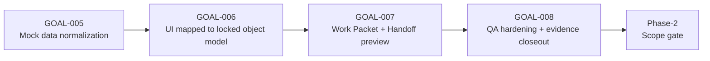
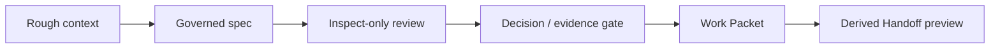

# OpenClaw Cooperative Cockpit Static MVP หลัง GOAL-008

## บทสรุปผู้บริหาร

หลัง re-baseline จาก `main` ที่เปิดดูบน GitHub สถานะของรีโปชัดเจนว่าอยู่ “หลัง GOAL-008 closeout” แล้วจริง: ประวัติ commit ของ `main` แสดง merge PR #8 (`5d9d9e4`) เป็นรายการล่าสุดที่มองเห็นได้, `docs/ops/STATUS.md` ระบุว่า GOAL-005 ถึง GOAL-008 เสร็จครบ, และ `artifacts/evidence/GOAL-008-validation.md` บันทึกว่า browser/manual QA ผ่านทั้งแปดหน้า, ไม่พบ remote HTTP(S) requests, ไม่พบ unsafe action labels, และ `npm run validate` ผ่านครบตาม script ใน `package.json` ด้วย. citeturn20view0turn8view0turn11view3turn4view0

คำตัดสินของแพ็กเกจ scope gate นี้คือ **READY_WITH_POLISH** ไม่ใช่ `READY_FOR_DEMO` และยังไม่ถึงขั้น `NEEDS_STATIC_FIXES` เพราะตัว static MVP พิสูจน์เส้นทาง product wedge หลักได้แล้ว—bounded context → governed spec → inspect-only review → decisions/evidence → Work Packet → gated Handoff preview—ภายใต้ boundary ที่ยังเป็น local-only, mock-only และ no-network อย่างเคร่งครัด. แต่ยังควร polish ก่อนใช้เป็น “public-facing proof” เพราะเอกสารฝั่ง product บางชิ้นยังสะท้อนสถานะ pre-closeout อยู่, `npm run validate` ยังเน้น repo hygiene มากกว่าการ smoke test behavior ของ UI โดยตรง, และความหมายของ Work Packet กับ Handoff Packet ยังควรถูกทำให้สั้น ชัด และสม่ำเสมอกว่านี้ใน UI ชั้นบน. citeturn10view3turn9view0turn18view0turn11view3turn4view0

ทางเลือกที่ควรเดินใน Phase-2 คือ **Option C: stronger Work Packet/Handoff contract** โดยดึง **minimum viable evidence/trace clarity** จาก Option B เข้ามาเป็น acceptance criteria ไม่ใช่ไปเปิดงาน runtime, backend, connectors, MCP, auth, database, deployment หรือหน้าใหม่ เพราะ repo ล็อก boundary พวกนั้นไว้อยู่แล้ว และเอกสารทางการของ Dify, LangGraph/LangSmith, และ OpenAI Agents SDK ก็แสดงชัดว่าพื้นที่ “workflow runner / tool orchestration / tracing / deployment / handoffs runtime” เป็นสนามที่ผลิตภัณฑ์พวกนั้นครอบไว้แล้ว. OpenClaw จะต่างได้ก็ต่อเมื่อมันยืนอยู่ฝั่ง “pre-runtime governance cockpit” อย่างมีวินัย. citeturn22view0turn11view1turn25view0turn25view1turn25view3turn26view0turn26view1turn25view4turn25view5turn25view6turn25view7

| เรื่อง | คำตัดสิน | หลักฐาน |
|---|---|---|
| Verdict | **READY_WITH_POLISH** | Latest `main` หลัง PR #8, GOAL-005–008 complete, QA closeout และ validation ผ่าน citeturn20view0turn8view0turn11view3turn4view0 |
| Demo scope ที่รองรับ | พร้อมสำหรับ internal demo, design review, และ Phase-2 scope gate ที่พูดตรงว่าเป็น **static prototype** | README ของ MVP ระบุชัดว่าเป็น static frontend prototype, eight pages, no backend/API/external execution; GOAL-008 ยืนยัน no-network/no-unsafe-label citeturn27view0turn11view3 |
| สิ่งที่ยังไม่ควร claim | “working orchestrator”, live handoff, runtime workflow, connectors, deployment-friendly runner | Point-lock decisions และ scope guardrails บังคับให้ใช้คำว่า static prototype และห้าม runtime/backend/connectors/MCP/new pages โดยไม่ได้ lock ก่อน citeturn11view1turn22view0 |
| Recommended Phase-2 | **Option C** พร้อมผนวก **minimum Option B** | Object model ล็อกให้ Work Packet เป็น core object และ Handoff Packet เป็น derived preview; ภายนอกมีคู่แข่งครอบ runtime/orchestration อยู่แล้ว citeturn9view0turn25view0turn25view3turn26view0turn25view4turn25view5turn25view7 |

## แผนวิจัยและฐานหลักฐาน

แพ็กเกจวิจัยนี้ตั้งต้นจากคำถามหลักห้าข้อ: รีโป `main` หลัง GOAL-008 อยู่ในสภาพไหน, default validation ครอบคลุมอะไรและไม่ครอบคลุมอะไร, object model ถูกทำให้มองเห็นบนทั้งแปดหน้าจริงหรือไม่, handoff-readiness ชัดพอสำหรับทั้ง business user และ coding agent หรือยัง, และ product wedge ของ OpenClaw ควรหยุดอยู่ตรงไหนเมื่อเทียบกับ Dify, LangGraph/LangSmith, และ OpenAI Agents SDK. ฐานหลักฐานจึงให้น้ำหนักตามลำดับนี้: repo docs และ evidence ในรีโปก่อน, app shell และ mock/UI source ถัดมา, และ official docs ภายนอกเฉพาะเท่าที่จำเป็นเพื่อกัน scope drift. citeturn8view0turn11view3turn27view0turn25view0turn25view3turn26view0turn25view4

ตารางด้านล่างคือไฟล์และ path ที่เปิดตรวจจริงระหว่างงานนี้

| กลุ่ม | ไฟล์และ path ที่เปิดตรวจ | เหตุผล |
|---|---|---|
| Ops baseline | `docs/ops/STATUS.md`, `package.json`, `quality/QA_CHECKLIST.md` | ยืนยันสถานะ `main`, validation scope, repo guardrails |
| Static MVP QA | `apps/static-mvp/QA_CHECKLIST.md`, `artifacts/evidence/GOAL-008-validation.md` | ยืนยัน eight-page QA, no-network, no-unsafe-label, handoff gating |
| Product lock docs | `STATIC_MVP_OBJECT_MODEL.md`, `STATIC_MVP_SCREEN_MAP.md`, `STATIC_MVP_GOLDEN_SCENARIO.md`, `STATIC_MVP_MOCK_DATA_SPEC.md`, `STATIC_MVP_ROADMAP.md`, `BUILD_DEFER_KILL_REGISTER.md`, `POINT_LOCK_DECISIONS.md`, `CODEX_EXECUTION_SEQUENCE.md`, `SCOPE_GUARDRAILS_AND_POINT_LOCKS.md` | ใช้เป็น source-of-truth เรื่อง object model, page map, defer/kill, Point lock และ Codex boundaries |
| App shell | `apps/static-mvp/index.html`, `apps/static-mvp/README.md` | ยืนยัน shell, page labels, visual direction, explicit non-implemented scope |
| UI logic | `apps/static-mvp/src/app.js`, `mockData.js`, `state.js`, `router.js` | ตรวจ render surface, readiness logic, mock entities, disabled controls |
| Styles | directory listing ของ `styles/`, `styles/base.css`, `styles/fonts.css` | ยืนยัน light studio shell และ local font assets |
| External boundary | Official docs ของ Dify, LangGraph/LangSmith, OpenAI Agents SDK | ใช้กำหนด “what OpenClaw must not become” |

สมมติฐานที่ถือไว้ในแพ็กเกจนี้มีสามข้อสำคัญ: ตัว GitHub connector ผ่าน `api_tool` ไม่ได้มี callable endpoint ที่เรียกใช้งานได้จริงในเซสชันนี้ จึงใช้หน้า GitHub public และ raw file ของรีโปเดียวกันเป็น primary repo evidence แทน; ไม่มีการ checkout รีโปแบบ local ในสภาพแวดล้อมนี้ จึงไม่ได้รัน `git status --short` และ `git log --oneline -5` กับ working tree จริง; และผล browser QA / `npm run validate` อ้างจาก `artifacts/evidence/GOAL-008-validation.md` กับ `package.json` ไม่ใช่การ rerun สดในเซสชันนี้. สมมติฐานเหล่านี้ไม่เปลี่ยนข้อสรุปหลัก เพราะ public commit history ของ `main` และไฟล์ evidence ล่าสุดสอดคล้องกันและอยู่ในช่วงเวลาเดียวกัน. citeturn20view0turn11view3turn4view0

## สถานะรีโปปัจจุบัน

ถ้ามองรีโปเป็น product line หลัง closeout จะเห็นลำดับการแข็งตัวค่อนข้างชัด: GOAL-005 ทำ mock data normalization ให้เข้ากับ object model, GOAL-006 map UI เข้ากับ locked object model, GOAL-007 ทำ Work Packet กับ derived Handoff Packet preview ให้มองเห็น, และ GOAL-008 ปิดงาน QA hardening + evidence closeout. `STATUS.md` ระบุครบ และ GOAL-008 evidence ย้ำว่าไม่มี dependency ใหม่, ไม่มี backend/API/auth/database/deployment, ไม่มี runtime workflow execution หรือ real orchestration ถูกแอบเพิ่มเข้ามาใน closeout ชุดนี้. citeturn8view0turn11view3



สถานะเชิงปฏิบัติการของรีโป ณ จุดนี้สรุปได้ดังนี้

| ประเด็น | สถานะปัจจุบัน | หลักฐาน |
|---|---|---|
| Latest visible commit on `main` | Merge PR #8: `5d9d9e4` จาก branch `agent/GOAL-008-qa-hardening-evidence` | Commit history บน GitHub แสดงรายการนี้เป็นล่าสุดบน `main` citeturn20view0 |
| Validation status | `npm run validate` PASS; browser QA 1 test PASS; all eight pages reachable; no ninth page; no remote HTTP(S) requests; no unsafe labels | GOAL-008 evidence + `package.json` validate script citeturn11view3turn4view0 |
| Completed goals | GOAL-001, GOAL-002, GOAL-003A, GOAL-004, GOAL-005, GOAL-006, GOAL-007, GOAL-008 complete | `STATUS.md` completed assimilation table citeturn8view0 |
| Operating boundary | Static MVP ยังเป็น offline, mock-only, directly openable via `apps/static-mvp/index.html`, no dependencies added, no backend/API/auth/database/deployment/real AI/runtime mutation/repo-write behavior | `STATUS.md`, MVP README, scope guardrails citeturn8view0turn27view0turn22view0 |
| Center of gravity intent | Workbench/Cockpit canvas ยังถูกล็อกให้เป็น center of gravity; Home ทำหน้าที่ Project Overview | Screen map + Point-lock docs + MVP README citeturn10view0turn11view1turn27view0 |

ความเสี่ยงค้างที่สำคัญไม่ได้อยู่ที่ “สภาพพัง” ของแอป แต่เป็น **ความคมของ package หลัง closeout** มากกว่า กล่าวคือ roadmap ยังจบด้วยคำแนะนำให้รัน GOAL-004 ซึ่งล้าสถานะปัจจุบันแล้ว, metadata บางไฟล์ product-lock ยังขึ้น `Draft for Point review/lock`, และ default validation path ใน `package.json` ยังไม่ได้รวม browser smoke, no-network, unsafe-label checks เข้าไว้ด้วยโดยตรง; checks เหล่านั้นอยู่ใน GOAL-008 evidence และ transient Playwright command แยกต่างหาก. นี่ไม่ใช่ blocker ต่อ internal demo แต่เป็น blocker ต่อการสื่อสารว่ารีโป “พร้อมนำไปขยาย” โดยไม่ทำ post-closeout packaging ก่อน. citeturn10view3turn9view0turn10view0turn11view1turn4view0turn11view3

| ความเสี่ยงค้าง | ทำไมจึงสำคัญ | ระดับ | หลักฐาน |
|---|---|---|---|
| Product docs ยังไม่ re-baseline หลัง closeout เต็มรูปแบบ | ทำให้ Phase-2 เริ่มจากเอกสารที่ยังพูดภาษาก่อน GOAL-008 และอาจชี้ Codex ไป goal เก่า | สูง | `STATIC_MVP_ROADMAP.md` ยังจบด้วย “Run GOAL-004”; object/screen docs ยังขึ้น Draft citeturn10view3turn9view0turn10view0 |
| Terminology drift | Object model ล็อก “Decision” และ “Selected Context” แต่ mock data/UI ยังมี `Decision Lock` และ `Context Basket` อยู่ในบาง surface | สูง | Object model + mockData + MVP README citeturn9view0turn16view0turn18view0turn27view0 |
| Validation coverage gap | Default `npm run validate` ผ่านได้แม้ browser behavior จะยังไม่ถูก re-check ในรอบใหม่ | กลาง | `package.json` vs GOAL-008 evidence command set citeturn4view0turn11view3 |
| Builder-clone drift | README ระบุ visual direction แบบ Dify-inspired workflow studio; ถ้า polish ผิดทางจะกลายเป็น workflow builder clone แทน governance cockpit | สูง | MVP README + build/defer/kill register + Dify docs citeturn27view0turn11view0turn25view0turn25view1 |
| Placeholder credibility gap | Preview ยังเป็น placeholder และ trace graph ยังเป็น placeholder text area; blocked state ชัดกว่า ready state | กลาง | MVP README, app logic, QA checklist citeturn27view0turn19view3turn19view5turn8view2 |

## การตรวจความพร้อมเดโมของ Static MVP

โดยภาพรวม static MVP ชุดนี้ “พิสูจน์ product wedge ได้จริง” มากกว่าที่พิสูจน์ “ready state” ได้สมบูรณ์ กล่าวคือ repo แสดง surfaces สำคัญครบ: Project, Context Node, Selected Context, Spec Draft, Review Run, Findings, Decisions, Evidence, Artifact Reference, Work Packet, derived Handoff Packet, และ Validation/Rules surfaces ถูกยืนยันใน GOAL-008 browser QA แล้ว. แต่ widget/คำอธิบายบางส่วนยังอยู่ในรูป placeholder หรือ blocked-state heavy narrative ทำให้มันพร้อมสำหรับ demo แบบ governance-first มากกว่าพร้อมสำหรับ demo แบบ “look, it works end to end.” citeturn11view3turn10view0turn9view0turn27view0

| หน้า | สิ่งที่หน้าต้องพิสูจน์ | สถานะ | ช่องว่างหลัก | หลักฐาน |
|---|---|---|---|---|
| Home | เป็น Project Overview ที่รวม project status, selected context summary, pending decisions, Work Packet, validation summary โดยไม่แย่งศูนย์ถ่วงจาก Workbench | พร้อมแต่ควร polish | ถ้าเพิ่ม controls/gates มาที่หน้านี้อีกจะเริ่ม drift ไปเป็น dashboard แทน cockpit | Screen map + app home render + README citeturn10view0turn14view0turn27view0 |
| Workbench | เป็น center of gravity แบบ canvas-first สำหรับ Context Nodes, Selected Context, protected exclusions, object links, inspector | พร้อม | ควรลดคำที่ทำให้คิดถึง builder runtime เช่น `Context Basket` ใน user-facing copy | Screen map + app workbench render + README citeturn10view0turn19view0turn27view0 |
| Spec Builder | พิสูจน์ governed spec, field locking, readiness panel, validation gating | พร้อมแต่ควร polish | รายชื่อ template กว้างเกินจำเป็นและบางชื่อพาไปทาง runtime/integration/read-model ก่อนเวลา | App render + QA checklist citeturn19view1turn8view2 |
| Review Runs | พิสูจน์ว่า review เป็น inspect-only และ Findings เป็น advisory objects ไม่ใช่ execution | พร้อม | ต้องรักษา inspect-only language ต่อไป และไม่ให้ action diverge ไปเป็น live remediation | Screen map + app review render + QA checklist citeturn10view0turn19view2turn8view2 |
| Preview | พิสูจน์ Artifact Reference, spec coverage, blockers, static handoff preview | พร้อมแต่ควร polish | Preview frame ยังเป็น placeholder และควรอธิบายให้ชัดขึ้นว่ามันเป็น evidence surface ไม่ใช่ generated output | Screen map + app preview render + README citeturn10view0turn19view3turn27view0 |
| Decisions | พิสูจน์ Point-lock mechanics โดยเฉพาะ D-005 เป็น governance checkpoint | พร้อม | ควรทำภาษา “Decision” ให้ชนะภาษา “Decision Lock” ในทุก surface | App decisions render + mockData + point-lock docs citeturn19view4turn18view0turn11view1 |
| Trace & Evidence | พิสูจน์ evidence links, artifact references, missing-evidence warning, trace lineage | พร้อมแต่ควร polish | เป็นหน้าที่เปิดโอกาสเพิ่มความน่าเชื่อถือได้มากที่สุด เพราะ graph ยัง placeholder | Screen map + app trace render + README citeturn10view0turn19view5turn27view0 |
| Rules & Scope | พิสูจน์ guardrails, protected surfaces, review gates, validation/rules summary | พร้อม | ควร cross-link สถานะ validation กับ handoff blockers ให้สั้นและคมขึ้น | Screen map + app rules render + QA checklist citeturn10view0turn19view6turn8view2 |

| Object | การมองเห็นปัจจุบัน | ประเมิน | หมายเหตุ | หลักฐาน |
|---|---|---|---|---|
| Project | Home + top shell | ชัด | เห็นทั้งชื่อ, summary, stage, status | GOAL-008 visibility + screen map + app home render citeturn11view3turn10view0turn14view0 |
| Context Node | Workbench canvas + inspector | ชัด | เป็น surface ที่ชัดที่สุดของ Workbench | GOAL-008 visibility + screen map + app workbench render citeturn11view3turn10view0turn19view0 |
| Selected Context | Workbench panel และ Home summary | ชัดแต่คำเรียกยังแกว่ง | ควรดันชื่อ `Selected Context` ให้ชนะ `Context Basket` ใน copy สำคัญ | Object model + mockData + README citeturn9view0turn16view0turn18view0turn27view0 |
| Spec Draft | Spec Builder + Preview | ชัด | readiness และ field status ถูกแสดงชัด | Screen map + spec builder render + mockData spec fields citeturn10view0turn19view1turn18view0 |
| Review Run | Review Runs | ชัด | review object และ scope มีตัวตนชัด | Object model + QA + app review render citeturn9view0turn8view2turn19view2 |
| Findings | Review Runs + Preview | ชัด | advisory-only semantics มองเห็นได้ | Screen map + app review render + mockData findings citeturn10view0turn19view2turn18view0 |
| Decisions | Decisions + Home | ชัด | D-005 ทำหน้าที่เป็น visible governance checkpoint | Screen map + decisions render + mockData decisions citeturn10view0turn19view4turn18view0 |
| Evidence | Trace & Evidence | ปานกลางถึงชัด | table ดีพอใช้ แต่ graph ยัง placeholder | GOAL-008 visibility + README + trace render citeturn11view3turn27view0turn19view5 |
| Artifact Reference | shell + Home + Preview + Trace | ปานกลางถึงชัด | มีอยู่จริงแต่ยังเป็น supporting surface มากกว่า hero object | Object model + mockData + app home/trace/preview render citeturn9view0turn18view0turn14view0turn19view3turn19view5 |
| Work Packet | Home + Handoff preview surfaces | ชัดพอสำหรับ coding agent / ยัง abstract สำหรับ business user | ต้องสั้นและกระชับขึ้นในภาษา business-facing | Object model + mockData + README citeturn9view0turn18view0turn27view0 |
| Handoff Packet | Derived static preview | ชัดระดับ concept, ยังไม่ชัดระดับ persuasion | จุดแข็งคือ gated/derived; จุดอ่อนคือยังดู abstract และ placeholder-heavy | Object model + GOAL-007/008 status + mockData | citeturn9view0turn8view0turn18view0 |
| Validation Result | Home + Rules + handoff preview | มองเห็นได้แต่เป็น supporting surface | ควรเชื่อมกับ blocker language ให้มากขึ้น | Object model + mock data spec + mockData validationResults citeturn9view0turn10view2turn18view0 |

| Handoff-readiness gate | สภาพปัจจุบัน | ความหมายเชิงผลิตภัณฑ์ | หลักฐาน |
|---|---|---|---|
| Acceptance criteria | `specFields.acceptance-criteria` ยัง `missing` | blocked-state ชัด แต่ยังขาด story ของ ready-state | mockData spec fields + readiness preview citeturn18view0 |
| Validation method | `validation-method` ยัง `needs-lock` | repo-level validation ผ่านได้ โดย product-level readiness ยัง block อยู่ได้ | mockData spec fields + `npm run validate` evidence citeturn18view0turn11view3turn4view0 |
| D-005 decision | `needs-lock` และเป็น checkpoint หลัก | governance gate นี้ชัดและเป็นจุดเด่นของ wedge | mockData decisions + decisions page render + golden scenario doc citeturn18view0turn19view4turn10view1 |
| Required evidence | มี `locked-decision` missing และ evidence review ยังไม่ clear | ทำให้ Handoff preview ถูก block ด้วยเหตุผลที่ audit ได้ | mockData evidenceItems + handoffPacketPreview blocked_by citeturn17view0turn18view0 |
| Review blockers | app logic ยังนับ high-severity reviews เป็น blockers จนกว่าจะ acknowledge locally | ดีต่อ governance แต่ควรอธิบายให้ business user เข้าใจง่ายขึ้น | app readiness logic + mockData reviewResults citeturn14view0turn18view0 |
| Control behavior | Handoff/gated-preview controls remain disabled while readiness blocked | guardrail ทำงานถูก; ปลอดภัยต่อ scope claim | GOAL-008 evidence + MVP QA checklist citeturn11view3turn8view2 |

| Governance / guardrail | สถานะ | สรุป | หลักฐาน |
|---|---|---|---|
| Eight pages only | ผ่าน | GOAL-008 ยืนยัน page count ยังเป็น 8 และไม่มีหน้าที่ 9 | GOAL-008 evidence + screen map rule citeturn11view3turn10view0 |
| No network / API calls | ผ่าน | Browser QA จับว่าไม่มี remote HTTP(S) requests หลังโหลด local files | GOAL-008 evidence + MVP README citeturn11view3turn27view0 |
| No backend/auth/db/deploy/runtime/orchestration/connectors/MCP | ผ่าน | ทั้ง status, roadmap, guardrails และ QA ล็อกเรื่องนี้ตรงกัน | `STATUS.md`, roadmap, scope guardrails, QA checklists citeturn8view0turn10view3turn22view0turn8view1turn8view2 |
| No unsafe labels | ผ่าน | GOAL-008 browser scan ไม่พบ live-action labels ที่ผิด boundary | GOAL-008 evidence + QA checklist citeturn11view3turn8view1turn8view2 |
| Local assets only | ผ่าน | fonts.css ใช้ local `.ttf`; README ระบุ no CDN/runtime asset loading | `fonts.css` + MVP README citeturn21view0turn27view0 |
| Repo writes | ผ่าน | shell ระบุ “Handoff only”; README และ QA ระบุ controls เป็น alert/mock-only ไม่เขียนไฟล์จริง | `index.html` + MVP README + QA checklist citeturn13view1turn27view0turn8view2 |
| Public claim discipline | ต้องคุมต่อเนื่อง | ควรใช้คำว่า static prototype และห้าม imply working orchestrator | Point-lock decisions + scope guardrails citeturn11view1turn22view0 |

## การประเมิน Product Wedge และทางเลือก Phase-2

แก่นของ OpenClaw ที่พิสูจน์ได้จากรีโปนี้ไม่ใช่ “agent runtime” แต่เป็น **artifact-first governance cockpit** สำหรับทำให้คนมองเห็นว่า rough context ถูกทำให้กลายเป็น governed spec, inspect-only findings, lock decisions, evidence links, Work Packet, และ derived Handoff preview อย่างไรโดย **ไม่ต้องมี runtime execution** เลย. Golden scenario ของ repo เองก็เขียนเส้นทางนี้ตรง ๆ และ mock data ก็ encode path เดียวกันไว้ใน `primaryDemoPath` พร้อม blockers อย่าง `Acceptance criteria missing`, `Required evidence missing`, และ `D-005 decision lock open`. citeturn10view1turn18view0turn27view0

repo ยังย้ำชัดว่า Workbench/Cockpit canvas ต้องเป็นศูนย์ถ่วงของผลิตภัณฑ์ และ README ของ MVP อธิบาย visual direction ว่าเป็น Dify-inspired workflow studio with governance overlays—not a real workflow runner. ในเชิงตีความ นี่แปลว่า “แรงดึงดูด” ทาง UX ไปทาง builder-style shell มีอยู่จริง แต่เอกสารในรีโปก็ล็อกไว้ว่าห้ามปล่อยให้มันกลายเป็น Dify-like drag/drop workflow builder. ถ้า Phase-2 ไม่ sharpen object semantics และ evidence contract ให้ดี การเลียนแบบ visual metaphor จะเริ่มกลบ wedge ทาง governance. citeturn10view0turn27view0turn11view0



| Surface ภายนอก | Official docs บอกว่าอะไร | นัยต่อ OpenClaw | หลักฐาน |
|---|---|---|---|
| Dify | Dify เป็น open-source platform สำหรับ **building agentic workflows**, ให้กำหนดกระบวนการแบบ visual, เชื่อม tools/data sources และ deploy apps; Agent node ให้ LLM คุม tools แบบ autonomous | ถ้า OpenClaw ขยับไปฝั่ง workflow/runtime/tool orchestration จะชนพื้นที่ของ Dify ทันที | Dify introduction + Agent node docs citeturn25view0turn25view1 |
| LangGraph | LangGraph แยก workflows ที่มี predetermined code paths ออกจาก agents ที่ define process/tool usage เอง และชู persistence, streaming, debugging, deployment | ถ้า OpenClaw ขยับไปเป็น graph runtime หรือ workflow engine มันจะกลายเป็น execution substrate มากกว่าจะเป็น governance cockpit | LangGraph workflows & agents docs citeturn25view3 |
| LangSmith | LangSmith วางตัวเป็น observability + evaluation + monitoring + dashboards + alerts + automations + deployment workflow จาก local dev ถึง production | ถ้า OpenClaw ขยับไปเป็น trace/eval/monitoring platform มันจะวิ่งเข้าพื้นที่ observability platform เต็มตัว | LangSmith observability/evaluation/home docs citeturn26view0turn26view1turn25view2 |
| OpenAI Agents SDK | OpenAI Agents SDK เหมาะเมื่อ app ฝั่ง server เป็นเจ้าของ orchestration, tool execution, approvals, state; handoffs เป็น runtime tool-like capability; tracing built-in; human review pause risky side effects | ถ้า OpenClaw ขยับไปทำ orchestration, handoffs runtime, guardrails runtime, MCP/integrations มันจะซ้อนหน้าที่ SDK/runtime platform โดยตรง | OpenAI Agents SDK, handoffs, tracing, guardrails docs citeturn25view4turn25view5turn25view6turn25view7 |

ดังนั้น wedge ที่ควรรักษาไว้คือ: **“ก่อนจะมี runtime จริง เราทำให้ bounded context, decisions, evidence, and handoff eligibility มองเห็นและ audit ได้ก่อน”** นี่คือพื้นที่ที่ repo ล็อกไว้แล้ว และเป็นพื้นที่ที่ยังไม่ถูก Dify/LangGraph/OpenAI Agents SDK ครอบแบบตรงตัว เพราะสามกลุ่มนั้นต่างเน้น runtime, orchestration, observability, deployment, หรือ tool execution โดยตรง. citeturn9view0turn10view3turn11view1turn25view0turn25view3turn26view0turn25view4

| Option | เนื้อหางาน | ข้อดี | ความเสี่ยง | คำประเมิน |
|---|---|---|---|---|
| A: demo polish only | เก็บ copy, labels, docs metadata, visual cleanup | เร็ว และช่วยลดความสับสน | ไม่เพิ่มความคมของ wedge มากพอ | ควรทำ แต่ไม่ควรเป็น path หลัก |
| B: stronger evidence/trace presentation | ทำ evidence cards, blocked-by language, legend, clearer trace table | เพิ่ม credibility ทันที | ถ้าทำเดี่ยว ๆ จะกลายเป็น cosmetic trace polish | ควรทำในขนาดเล็กเป็นส่วนหนึ่งของ C |
| C: stronger Work Packet / Handoff contract | ทำให้ Work Packet เป็น hero object และ Handoff Packet เป็น derived, gated preview อย่างสม่ำเสมอ | ตรงกับ object model, กัน drift ไป runtime, สื่อสารกับ coding agent ได้ดีที่สุด | ต้องคุม copy และ terminology ให้ละเอียด | **แนะนำที่สุด** |
| D: repo snapshot / read-model preview แบบ static/local | สร้าง preview ว่าอนาคตจะอ่าน repo/snapshot อย่างไร โดยยัง mock-only | ช่วยเล่า roadmap ถ้าทำอย่างระวัง | เสี่ยงโดนตีความเป็น repo integration / connector scope | ทำได้เฉพาะแบบ conditional และต้อง Point lock ก่อน |
| E: runtime/backend/connectors | orchestration, backend/API/auth/db/deploy, connectors, MCP | ธีมใหญ่และ tempting | ฝ่าฝืน scope guardrails, ชนตลาดคนอื่น, เปิดความซับซ้อนเร็วเกินไป | **defer ชัดเจน** |

ข้อแนะนำจึงเป็น **Option C เป็นแกน** แล้วเอา **Option B เฉพาะขั้นต่ำ** มาช่วยให้ packet และ evidence อ่านเข้าใจง่ายขึ้นใน path เดียวกัน เหตุผลคือมัน reinforce ของที่ repo ล็อกไว้แล้ว—Workbench เป็นศูนย์ถ่วง, Work Packet เป็น core object, Handoff Packet เป็น derived preview, D-005 เป็น governance checkpoint และทุกอย่างต้องยัง static/mock-only—ในขณะที่เลี่ยงการวิ่งเข้าไปชน runtime surfaces ที่ official docs ภายนอกครอบอยู่แล้ว. Option A อย่างเดียวเบาเกินไป, Option D ทำเร็วเกินไปจะเสี่ยงสื่อสารผิด, และ Option E ควรอยู่หลัง Point lock เท่านั้น. citeturn10view0turn9view0turn11view1turn22view0turn25view0turn25view3turn26view0turn25view4turn25view5turn25view7

## Golden Scenarios สำหรับใช้เป็น baseline

ตารางนี้เสนอ **ห้า golden scenarios** ที่ใช้ของเดิมทั้งแปดหน้าเท่านั้น และรักษา static/mock-only boundary ตาม README, screen map, object model, และ QA docs. จุดประสงค์ไม่ใช่เพิ่มหน้าใหม่ แต่ทำให้แต่ละ persona มี “เรื่องเล่าที่จบในตัวเอง” ภายใน shell ปัจจุบัน. citeturn27view0turn10view0turn10view1turn9view0turn8view2

| สถานการณ์ | User goal | Starting context | Page flow | Visible objects | Success criteria | Failure / blocker state | Artifact produced | หลักฐานฐานรองรับ |
|---|---|---|---|---|---|---|---|---|
| Context-to-handoff baseline | ผู้ใช้ต้องการพิสูจน์ว่า rough context ถูกแปลงเป็น governed spec และ gated handoff ได้โดยไม่ต้อง run อะไรจริง | Home แสดง draft project, selected context summary, pending decision, blocked readiness | Home → Workbench → Spec Builder → Preview | Project, Context Nodes, Selected Context, Spec Draft, Artifact Reference, Work Packet, Handoff Packet | ผู้ใช้เล่าเส้นทาง “rough context → governed spec → gate → preview” ได้จบใน 2–3 นาที | acceptance criteria ยัง missing, D-005 ยังเปิด, evidence ยังไม่ครบ | Spec Draft view + blocked Handoff preview แบบไม่เขียนไฟล์ | Golden scenario doc + mockData primaryDemoPath citeturn10view1turn18view0 |
| Inspect-only review proof | ผู้ใช้ต้องการพิสูจน์ว่าระบบ review ได้แต่ไม่ execute และไม่ auto-fix | Spec Builder ยังไม่ complete ทั้งหมด แต่พร้อมให้ review อ่าน | Spec Builder → Review Runs → Decisions | Spec Draft, Review Run, Findings, Decisions | stakeholder เข้าใจว่าผล review เป็น advisory objects ไม่ใช่ live execution | ปุ่มหรือ copy ถูกตีความเป็น run/fix/deploy | Finding set ที่เชื่อมกลับไปยัง review run และ decision gate | QA checklist + app review render + mockData findings citeturn8view2turn19view2turn18view0 |
| Evidence-gap audit | ผู้ใช้ต้องการอธิบายว่า “ทำไมยัง handoff ไม่ได้” ด้วยหลักฐาน ไม่ใช่ความรู้สึก | D-005 ยังไม่ lock และ trace ยังมี missing links | Workbench → Trace & Evidence → Preview | Selected Context, Evidence, Artifact Reference, Spec coverage, blocked-by reasons | ผู้ใช้ชี้ได้ว่าลิงก์ไหนขาด และขาดแล้วบล็อกอะไร | trace graph อ่านไม่ออก หรือ missing-evidence reason ไม่ผูกกับ object จริง | Evidence map + missing evidence warning | Screen map + README + mockData evidence/traceLinks citeturn10view0turn27view0turn18view0 |
| Point-lock walkthrough | ผู้ใช้ต้องการพิสูจน์ human approval checkpoint โดยไม่ทำให้มันดูเป็น deployment approval | Home แสดง pending decisions โดยเฉพาะ D-005 | Home → Decisions → Trace & Evidence → Preview | Decision, Evidence, Handoff Packet, Validation Result | ผู้ใช้เห็นว่า D-005 แค่ gate static handoff preview ไม่ได้ approve runtime/backend/live Codex work | คนดูตีความว่า D-005 คือ “กดผ่านแล้ว deploy/execute ได้” | Locked decision record + updated mock readiness state | Point-lock doc + decisions render + mockData decisions citeturn11view1turn19view4turn18view0 |
| Codex-safe handoff rehearsal | ผู้ใช้ต้องการอ่านขอบเขตที่ agent/build system “จะได้รับ” โดยยังไม่ export อะไรจริง | Work Packet และ Handoff preview ถูกแสดงใน mock state เดิม | Workbench → Spec Builder → Decisions → Trace & Evidence → Preview | Selected Context, Spec Draft, Decision, Evidence, Work Packet, derived Handoff Packet | coding agent หรือ reviewer อ่าน objective, allowed paths, forbidden actions, acceptance criteria, validation commands, stop conditions ได้ครบ | Packet ยัง abstract เกินไป หรือดูเหมือน real export | Work Packet summary + derived Handoff Packet preview | Object model + mockData handoffPacketPreview/workPacket + QA checklist citeturn9view0turn18view0turn8view2 |

## คำแนะนำเชิงปฏิบัติการสำหรับ Codex และ Review Gates

คำแนะนำเชิงปฏิบัติการของแพ็กเกจนี้คือ “build เฉพาะของที่ทำให้ wedge คมขึ้น และ defer ทุกอย่างที่ดันรีโปออกจาก static governance cockpit.” เอกสารในรีโปปัจจุบันสนับสนุนแนวทางนี้ชัดเจน: build/defer/kill register ห้าม clone Dify-like drag/drop builder, ห้าม `Run` labels, ห้าม fake execution logs, ห้าม standalone artifact page และ Codex execution sequence ก็ล็อก no backend/API/auth/database/deployment/runtime orchestration/connectors/MCP/new pages ไว้ทุก goal อยู่แล้ว. citeturn11view0turn11view2turn22view0

| Action | รายการ | เหตุผล | หลักฐาน |
|---|---|---|---|
| Build now | Re-baseline product docs หลัง GOAL-008, โดย update roadmap/claim surfaces ให้สะท้อน closeout จริง | ลดเอกสาร stale และกัน Codex เริ่มจาก assumption เดิม | Roadmap ยังชี้ GOAL-004; status ใช้ GOAL-008 เป็น baseline แล้ว citeturn10view3turn8view0 |
| Build now | Tighten Work Packet → Handoff Packet contract ให้เป็นภาษาหลักของ Home / Decisions / Trace / Preview | นี่คือ wedge หลักและดีที่สุดต่อทั้ง business user กับ coding agent | Object model + mockData packet preview citeturn9view0turn18view0 |
| Build now | ล้าง terminology drift: ใช้ `Decision` และ `Selected Context` เป็น user-facing default | ลดความสับสนระหว่าง object model กับ mock/UI | Point-lock docs + object model + mockData/README citeturn11view1turn9view0turn16view0turn27view0 |
| Build now | เพิ่ม evidence clarity บน Trace/Preview แบบไม่ใช้ dependency ใหม่ | ยกระดับ credibility โดยไม่เปิด runtime scope | README limitations + QA closeout + build/defer register citeturn27view0turn11view3turn11view0 |
| Build now | สร้าง five-scenario pack และ demo-claim checklist แบบเอกสาร | ช่วยให้ demo เล่า wedge ชัดโดยไม่เพิ่ม page | Golden scenario doc + point-lock public claim rule citeturn10view1turn11view1 |
| Defer | Richer static trace graph | มีประโยชน์ แต่ไม่ใช่ชิ้นแรกที่เพิ่ม differentiation | Roadmap P2 + build/defer register citeturn10view3turn11view0 |
| Defer | Static repo snapshot/read-model preview | ทำได้เฉพาะหลัง Point lock และต้องเป็น mock/local เท่านั้น | Scope guardrails + point-lock decisions citeturn22view0turn11view1 |
| Defer | Accessibility audit pass แบบเต็ม | ควรทำ แต่ยังเป็น P2 leveling ไม่ใช่ wedge-defining move | README known limitations + roadmap P2 citeturn27view0turn10view3 |
| Kill / avoid | Runtime builder semantics, connectors, MCP, backend, deploy/export claims | ฝ่าฝืนขอบเขตและชนตลาดที่ official docs ภายนอกครอบอยู่แล้ว | Guardrails + Dify/LangGraph/OpenAI docs citeturn22view0turn25view0turn25view3turn25view4 |
| Kill / avoid | New pages, fake execution logs, `Run` labels, generic artifact library | ทำให้ product drift และบั่นทอนความน่าเชื่อถือ | Build/defer/kill register + QA docs citeturn11view0turn8view1turn8view2 |

ต่อไปนี้คือ **copy-ready Codex `/goal` prompts** ที่ยึด guardrails เดิมของ repo, allowed-path discipline จาก GOAL-004 ถึง GOAL-008, และ validation pattern เดิม (`npm run validate`, `git diff --check`) โดยไม่เปิด forbidden scope ใหม่. citeturn11view2turn22view0turn8view1turn8view2turn11view3

```text
/goal P2-001 Post-closeout doc rebaseline

Objective:
Re-baseline the OpenClaw static MVP product docs after GOAL-008 so the repo no longer reads like a pre-closeout package.

Autonomy level:
A2 bounded

Allowed paths:
- docs/product/**
- docs/ops/STATUS.md
- quality/**
- artifacts/evidence/**

Forbidden actions:
- Do not modify apps/static-mvp/src/**
- Do not add dependencies
- Do not add pages
- Do not introduce backend, API, auth, database, deployment, runtime execution, external connectors, or MCP
- Do not change public claims beyond making them more precise and more constrained

Required work:
- Update product-doc metadata/status labels so they reflect the current post-GOAL-008 baseline
- Replace stale “next goal” references that still point at GOAL-004
- Align roadmap, claim surfaces, and build/defer/kill notes to the current repo state
- Add a compact Phase-2 baseline note that says GOAL-008 is the current QA closeout baseline
- Record evidence of the documentation rebaseline

Acceptance criteria:
- No stale “run GOAL-004 next” guidance remains in active product-lock docs
- Docs consistently describe the MVP as static, mock-only, local-only, and eight-page bounded
- Phase-2 recommendations do not include backend/runtime/connectors/MCP/new pages
- npm run validate passes
- git diff --check passes

Validation commands:
- npm run validate
- git diff --check

Stop conditions:
- Stop if app-source edits are required
- Stop if a new dependency is required
- Stop if a new page is required
- Stop if product positioning becomes ambiguous and needs Point lock

Final response format:
- Verdict:
- Changed files:
- Validation output:
- Evidence recorded:
- Remaining risks:
- Next recommended action:
```

```text
/goal P2-002 Tighten Work Packet and Handoff contract

Objective:
Make Work Packet the primary bounded implementation object and Handoff Packet the clearly derived static preview across the existing UI and mock data.

Autonomy level:
A2 bounded

Allowed paths:
- apps/static-mvp/src/app.js
- apps/static-mvp/src/mockData.js
- apps/static-mvp/src/state.js
- apps/static-mvp/styles/**
- apps/static-mvp/QA_CHECKLIST.md
- docs/product/**
- artifacts/evidence/**

Forbidden actions:
- Do not add dependencies
- Do not add pages
- Do not add export/download behavior
- Do not add backend, API, auth, database, deployment, runtime workflow execution, real agent orchestration, external connectors, or MCP
- Do not write files from the app
- Do not imply working orchestration

Required work:
- Align user-facing copy so Work Packet reads as the core build contract
- Align user-facing copy so Handoff Packet reads as a derived, gated, static preview
- Reduce terminology drift between Decision vs Decision Lock and Selected Context vs Context Basket
- Make D-005 read consistently as the static Codex handoff governance checkpoint
- Make blocked-by reasons consistent across Home, Decisions, Trace & Evidence, and Preview

Acceptance criteria:
- A reviewer can distinguish Work Packet from Handoff Packet without reading docs
- D-005 is visible as a static handoff gate and nothing more
- Handoff remains disabled or mock-only unless local readiness is clear
- No new pages or dependencies are introduced
- npm run validate passes
- Manual smoke check still shows eight pages only

Validation commands:
- npm run validate
- git diff --check

Stop conditions:
- Stop if packet semantics require a new page
- Stop if packet semantics imply live export, repo write, or runtime execution
- Stop if new product decisions beyond current Point locks are required

Final response format:
- Verdict:
- Changed files:
- UX changes made:
- Validation output:
- Evidence recorded:
- Remaining ambiguities:
- Next recommended action:
```

```text
/goal P2-003 Strengthen static evidence and trace presentation

Objective:
Increase the credibility of Trace & Evidence and Preview without changing architecture, adding dependencies, or introducing runtime behavior.

Autonomy level:
A2 bounded

Allowed paths:
- apps/static-mvp/src/app.js
- apps/static-mvp/src/mockData.js
- apps/static-mvp/styles/**
- apps/static-mvp/QA_CHECKLIST.md
- quality/**
- artifacts/evidence/**

Forbidden actions:
- Do not add graph libraries or visualization dependencies
- Do not add network calls
- Do not add repo scanning, external connectors, or MCP
- Do not add real file generation/export
- Do not add new pages

Required work:
- Improve evidence cards/table readability using existing components/styles only
- Make source-object to target-object relationships easier to read at a glance
- Show missing evidence and blocked-by reasons in shorter business-readable language
- Keep trace visuals obviously static and placeholder-safe
- Update QA to explicitly check the new evidence-readability surfaces

Acceptance criteria:
- At least two evidence items are easy to identify and trace in the UI
- Missing-evidence reasons are visible and business-readable
- The trace surface still cannot be mistaken for live telemetry
- No dependency, page, or runtime behavior is added
- npm run validate passes

Validation commands:
- npm run validate
- git diff --check

Stop conditions:
- Stop if the change would need a new visualization library
- Stop if the trace surface starts implying live runtime spans or observability
- Stop if the artifact would be mistaken for a real export

Final response format:
- Verdict:
- Changed files:
- Evidence/trace improvements:
- Validation output:
- Evidence recorded:
- Risks:
- Next recommended action:
```

```text
/goal P2-004 Build the five-scenario demo package

Objective:
Create a five-scenario static demo package that explains the OpenClaw wedge clearly to business stakeholders and coding agents without adding pages.

Autonomy level:
A2 bounded

Allowed paths:
- docs/product/**
- docs/ops/STATUS.md
- apps/static-mvp/README.md
- apps/static-mvp/QA_CHECKLIST.md
- quality/**
- artifacts/evidence/**

Forbidden actions:
- Do not add pages
- Do not modify runtime/app behavior unless absolutely necessary
- Do not add dependencies
- Do not introduce backend/runtime/connectors/MCP/export claims

Required work:
- Write five golden scenarios using the current eight pages only
- For each scenario, define user goal, starting context, page flow, visible objects, success criteria, failure state, and artifact produced
- Add a demo-claim checklist that forbids “working orchestrator” language
- Add a short presenter script for the primary scenario and the blocker explanation path
- Update QA/docs where needed to reflect the scenario pack

Acceptance criteria:
- Exactly five scenarios are documented
- All scenarios remain static, mock-only, and eight-page bounded
- Demo claims explicitly say static prototype/local-only
- No scenario requires backend, runtime execution, connectors, or new pages
- npm run validate passes

Validation commands:
- npm run validate
- git diff --check

Stop conditions:
- Stop if a scenario needs a new page
- Stop if a scenario can only work by implying runtime behavior
- Stop if public-claim language requires Point lock

Final response format:
- Verdict:
- Changed files:
- Scenarios added:
- Validation output:
- Evidence recorded:
- Demo-claim risks:
- Next recommended action:
```

```text
/goal P2-005 Conditional static repo snapshot preview definition

Objective:
Define, in docs only, whether a future static repo snapshot/read-model preview is worth pursuing as a Phase-2B concept without implementing repo access.

Autonomy level:
A2 bounded and conditional on Point lock

Allowed paths:
- docs/product/**
- artifacts/evidence/**

Forbidden actions:
- Do not modify app source
- Do not add connectors, repo scanning, file-system APIs, MCP, or runtime behaviors
- Do not add pages
- Do not imply actual repository access

Required work:
- Define the narrowest possible static/mock-only concept for a repo snapshot or read-model preview
- State what it would and would not prove
- List misinterpretation risks and demo-claim risks
- Recommend build / defer / kill for this concept
- Record the decision note as evidence

Acceptance criteria:
- The output remains docs-only
- The concept is explicitly static, local, and mock-only
- The concept does not imply connectors, repo writes, or live repo reads
- A clear recommendation says whether to defer or reject the concept now

Validation commands:
- npm run validate
- git diff --check

Stop conditions:
- Stop immediately if any app-source change is needed
- Stop if the concept implies real repo access
- Stop if Point lock is missing for the concept itself

Final response format:
- Verdict:
- Changed files:
- Concept definition:
- Build/defer/kill recommendation:
- Validation output:
- Evidence recorded:
- Risks:
```

สุดท้าย สิ่งที่ควรใช้เป็น **review gates** ก่อนปล่อยงาน Phase-2 ให้ Codex มีดังนี้

| Gate | สิ่งที่ต้องผ่าน | หลักฐาน |
|---|---|---|
| Point-lock decisions | Workbench ต้องยังเป็น center of gravity; Home ยังเป็น Project Overview; Work Packet เป็น core object; Handoff Packet เป็น derived preview; ไม่มี page/dependency/runtime/backend/connectors/MCP ใหม่; public demo claims ต้องใช้ภาษา “static prototype” | Screen map + point-lock decisions + scope guardrails citeturn10view0turn11view1turn22view0 |
| QA checks | `npm run validate` ผ่าน; `git diff --check` ผ่าน; eight pages only; no network/API; no unsafe labels; handoff controls gated ถูกต้อง | `package.json` + GOAL-008 evidence + QA checklists citeturn4view0turn11view3turn8view1turn8view2 |
| Demo claim checks | ทุก doc/UI/demo script ต้องพูดว่า static, local-only, mock-only; ห้ามใช้คำที่ imply orchestrator, export, deployment, live connections, runtime agent execution | MVP README + point-lock decisions + QA docs citeturn27view0turn11view1turn8view1turn8view2 |
| Stop conditions | ถ้าจำเป็นต้องเพิ่ม dependency, page, backend/API/auth/db/deploy, runtime execution, connectors, MCP, repo write behavior, หรือ semantics ใหม่ที่ยังไม่ lock ให้หยุดทันที | Scope guardrails + Codex execution sequence citeturn22view0turn11view2 |

สรุปให้สั้นที่สุดในเชิงตัดสินใจ: **รีโปนี้พร้อมเข้าสู่ Phase-2 แบบ “sharpen the contract, not the runtime.”** ถ้าจะขยับต่อ ให้ทำ post-closeout rebaseline แล้วเดิน Option C ก่อน—ทำ Work Packet/Handoff Packet ให้เป็นภาษาหลักของผลิตภัณฑ์, เพิ่ม evidence clarity เท่าที่จำเป็น, และคุม claim discipline อย่างเข้ม. นั่นเป็นเส้นทางที่เพิ่มความน่าเชื่อถือสูงสุดโดยไม่เปิด scope ที่รีโปห้ามไว้และไม่วิ่งเข้าไปซ้อนสิ่งที่ Dify, LangGraph/LangSmith, และ OpenAI Agents SDK ทำได้ดีกว่าอยู่แล้ว. citeturn8view0turn9view0turn11view1turn22view0turn25view0turn25view3turn26view0turn25view4turn25view5turn25view7