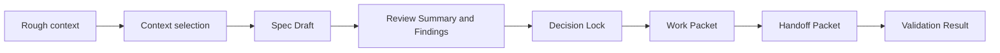
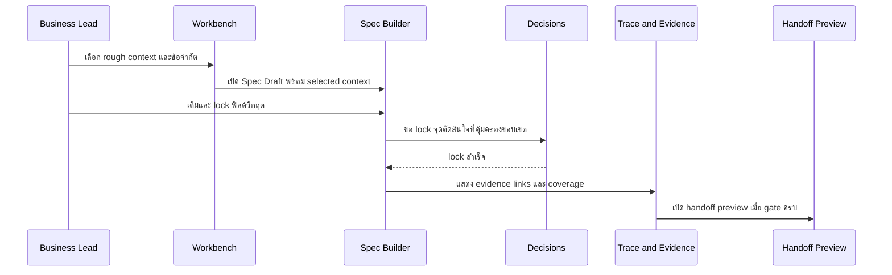

# รายงานวิจัยฉากสาธิตหลักสำหรับ OpenClaw Cooperative Cockpit Static MVP

## แผนและฐานข้อมูลการวิจัย

การวิจัยนี้เริ่มจากการตรวจแหล่ง GitHub repository `CharnritK/cooperative-cockpit` ที่ผู้ใช้ระบุเป็นแหล่งหลักก่อน แล้วจึงเทียบกับเอกสารทางการของ Dify, LangGraph/LangSmith, n8n, Flowise, OpenAI Agents, Microsoft Copilot Studio และ MCP เพื่อดึง “pattern” ด้าน canvas, review, handoff, tracing, guardrails, approval, และ human oversight โดยจงใจไม่ยืม semantics แบบ runtime execution, publish, deployment, หรือ external integration เข้ามาใน static MVP นี้ เพราะ repo ปัจจุบันและเอกสาร static-MVP ของโปรเจกต์ระบุชัดว่าเป็น local-only, mock-only, ไม่มี backend/API/auth/deployment, มีเพียง 8 หน้า และ handoff/export เป็นเพียง placeholder ที่ถูก gate ไว้ด้วย `appState.handoffReady` เท่านั้น citeturn7view4turn7view7turn8view0turn10view4turn10view5turn13view1turn15view0

ข้อมูลที่ใช้มีสามชั้นหลัก: ชั้นแรกคือบริบท OpenClaw ที่ผู้ใช้ให้มาและข้อมูลจาก repo; ชั้นที่สองคือเอกสารทางการของเครื่องมือใกล้เคียงเพื่อใช้เป็นหลักฐานเชิง convention; ชั้นที่สามคือข้อสันนิษฐานที่ต้องตั้งเพราะยังไม่มี concept notes, object-model research, screenshots, หรือ previous reports ของ OpenClaw ในบทสนทนานี้อย่างครบถ้วน. ฉะนั้นรายงานนี้เป็นงานออกแบบ “evidence-informed” มากกว่างานพิสูจน์เชิงตลาดแบบสมบูรณ์ และจะใส่ทุกช่องว่างไว้ใน Gap Backlog อย่างชัดเจน. citeturn7view4turn15view0turn16view0turn16view1turn16view6turn16view7turn21view0turn22view2

สมมติฐานที่ใช้แทนข้อมูลที่ยังไม่พบมีดังนี้: ไม่มีไฟล์ OpenClaw concept notes เพิ่มเติมนอกเหนือจาก prompt และ repo pages ที่เข้าถึงได้; ไม่มี object-model research ฉบับละเอียด; ไม่มี screenshots/mockups ภายนอกที่เป็น canonical source; ไม่มี requirement ที่เปิดให้เกิน 8 หน้า; และไม่มีสิทธิ์ตีความ static MVP ให้กลายเป็น runtime workflow builder. ชุด candidate objects ที่ประเมินในรายงานนี้คือ Workspace, Project, Context Node, Context Basket, Spec Template, Spec Draft, Review Run, Finding, Decision Lock, Artifact, Evidence, Handoff Packet, Agent Role, Validation Result และ Work Packet ตามโจทย์ที่ผู้ใช้ให้มา โดยคำแนะนำของรายงานนี้จะหลีกเลี่ยงการขยายโมเดลและใช้เพียง derived views เท่าที่จำเป็นเท่านั้น

**1. Executive Summary**

ข้อเสนอหลักของรายงานนี้คือให้ใช้ **Product spec creation** เป็น primary golden scenario แต่ต้องจบด้วยการเปิด **gated handoff preview** ไม่ใช่จบแค่การกรอก spec. เหตุผลคือเส้นทางนี้พิสูจน์แก่นของ OpenClaw ได้ครบที่สุดใน static MVP: ผู้ใช้เริ่มจาก rough context, เลือก context ที่ใช้ได้, สร้าง spec draft, เห็น evidence/trace, ผ่าน governance checkpoint, และเปิด work packet/handoff packet ที่พร้อมส่งต่อให้ builder โดยไม่อ้าง runtime execution จริง. Repo ปัจจุบันยังจัดหน้าและ state หลักไว้รองรับรูปแบบนี้อยู่แล้ว ได้แก่ Workbench, Spec Builder, Decisions, Trace & Evidence และ gating ผ่าน `handoffReady`; ในขณะที่เครื่องมือใกล้เคียงจำนวนมากถูกออกแบบให้ canvas และ workflow นำไปสู่ “execution” หรือ “publish” จริง ซึ่ง static MVP ของ OpenClaw ควรหลีกเลี่ยงโดยตั้งใจ. citeturn8view0turn9view0turn10view4turn10view5turn13view1turn16view0turn16view4turn16view6turn21view0turn22view0turn22view2

ชุด 5 golden scenarios ที่แนะนำคือ Product spec creation, UI mockup review, Codex implementation handoff, QA closeout และ Decision lock / scope control. ถ้าขาด scenario แรก OpenClaw จะดูเหมือนระบบ reviewer ที่ไม่มีพลังในการ “structure” งาน; ถ้าขาด scenario สองจะไม่มีหลักฐานว่า review/findings/evidence ทำงานอย่างมี governance; ถ้าขาด scenario สามจะไม่พิสูจน์ builder-ready outcome; ถ้าขาด scenario สี่จะไม่มี go/no-go gate; และถ้าขาด scenario ห้าจะเสียความต่างสำคัญที่สุด คือการล็อกขอบเขตและกัน scope drift. citeturn8view0turn9view0turn15view0turn16view1turn16view6turn17view0turn19view0

| item | recommendation |
|---|---|
| Recommended primary golden scenario | Product spec creation ending in a gated work-packet / handoff preview |
| Recommended 5-scenario set | Product spec creation; UI mockup review; Codex implementation handoff; QA closeout; Decision lock / scope control |
| One-sentence product story | OpenClaw เปลี่ยนบริบทที่กระจัดกระจายให้เป็น artifact ที่กำกับได้ มี evidence รองรับ และพร้อมส่งต่อเป็นงานที่มีขอบเขต |
| One-sentence demo story | ในเวลาไม่ถึงหนึ่งนาที ผู้ชมควรเห็นว่าผู้ใช้เลือก context, ได้ spec ที่ trace ได้, ผ่าน lock สำคัญหนึ่งจุด, และเปิด handoff packet ที่ยังคงเป็น static/mock เท่านั้น |
| Top 5 required UI states | Draft; Decision pending; Decision locked; Evidence attached; Handoff ready |
| Top 5 required mock data objects | Context Node; Spec Draft; Finding; Decision Lock; Handoff Packet |
| Top 5 scope traps to avoid | กลายเป็น runtime workflow engine; เพิ่มหน้าเกิน 8 หน้า; ใช้คำว่า Run/Execute/Publish บน action; ผูก review เข้ากับ execution จริง; ทำให้ handoff ดูเหมือน repo write จริง |
| Recommended next Codex `/goal` | จัดระเบียบ existing static MVP ให้เล่า scenario “rough context → governed spec → gated handoff preview” แบบครบเส้นเรื่องภายใน 8 หน้าเดิม |
| Confidence level | **Medium** — เพราะข้อจำกัด repo และ static-MVP boundary ชัดมาก แต่หลักฐาน OpenClaw-specific ที่อยู่นอก repo ยังขาด ทำให้บางส่วนต้องอาศัยการสังเคราะห์จาก official adjacent-product conventions |

ข้อเสนอเชิง object model คือ **คง candidate objects ทั้งหมดไว้เป็น working set** และยังไม่ merge object หลักในรอบนี้ ยกเว้นใช้ “Review Summary” และ “Artifact Manifest Entry” เป็น derived artifacts ไม่ใช่ core objects ใหม่. คำแนะนำด้านชื่อคือให้ **คงชื่อ Review Run** ไว้ เพราะ repo ใช้ชื่อหน้า “Review Runs” อยู่แล้วและเป็นฉลากเดียวที่อนุญาตให้มีคำว่า “Run”; ส่วน **Context Basket** สามารถใช้ label ฝั่ง UI เป็น “Selected Context” ได้โดยไม่จำเป็นต้องเปลี่ยน object name; และควร **แยก Work Packet ออกจาก Handoff Packet** ต่อไปเพราะสองอย่างนี้ตอบคำถามคนละชั้น: “งานอะไร” กับ “จะส่งให้ใครพร้อมหลักฐานอะไร”. citeturn9view0turn10view0turn10view4turn13view0turn15view0

**2. Input Inventory**

| input | provided_or_missing | how_used | confidence | gap_if_missing |
|---|---|---|---|---|
| OpenClaw concept notes | Missing beyond prompt context | ใช้ prompt และ repo docs แทน concept baseline | Medium | ต้องมี canonical product thesis / naming / audience note |
| Object model research | Missing as a standalone artifact | ใช้ candidate objects จาก prompt เป็น working model | Medium | ต้องการ semantic definitions และ lifecycle ต่อ object |
| Dify UX research | Partially provided via official docs | ใช้เทียบ canvas/execution semantics ที่ควร “ไม่” ลอกตรงมา | High | ต่ำ |
| Existing mockup/screenshots | Partial | ใช้ static-mvp README/QA docs เป็นตัวแทนของ current UI direction | Medium | ต้องการ screenshot set ที่ใช้เป็น visual canon |
| Repo notes | Provided | เป็น primary evidence สำหรับ page taxonomy, constraints, handoff gating, QA rules | High | ต่ำ |
| Current constraints | Provided | ใช้เป็น hard boundary ของทุกข้อเสนอ | High | ต่ำ |
| Candidate objects | Provided | ใช้กำหนด scenario graph และ artifact model | High | ต่ำ |
| Static MVP boundary | Provided and repo-corroborated | ใช้ล็อกจำนวนหน้า, no-backend, mock-only, open-from-index | High | ต่ำ |
| Operating roles | Provided and repo-corroborated | ใช้ map user_type / recipient / approval authority | High | ต่ำ |
| Workflow model | Provided and repo-corroborated | ใช้จัดลำดับ 5 scenarios ให้เป็น loop เดียว | High | ต่ำ |
| Artifact/evidence semantics | Provided and repo-corroborated | ใช้กำหนด required artifacts และ manifest expectations | High | ต่ำ |
| Validation context | Provided and repo-corroborated | ใช้สร้าง validation states, QA closeout, stop conditions | High | ต่ำ |
| Codex handoff requirements | Provided and repo-corroborated | ใช้ร่าง bounded `/goal` และ handoff packet structure | High | ต่ำ |

หมายเหตุสำคัญของ inventory นี้คือ repo README, static-MVP README, BUILD_SPEC, QA checklist, mock data และ operating workflow ให้หลักฐานระดับ “ข้อจำกัดเชิงผลิตภัณฑ์” ได้ค่อนข้างครบ: static MVP อยู่ใต้ `apps/static-mvp/`, เปิดจาก `index.html`, มี 8 หน้า, review เป็น inspect-only, handoff ถูก gate, และห้ามขยายไปสู่ backend/API/auth/deployment โดยไม่มี Point lock. citeturn7view4turn7view5turn7view6turn7view7turn8view0turn9view0turn10view4turn10view5turn13view0turn13view1turn15view0

## การคัดเลือกฉากสาธิตหลัก

**3. Golden Scenario Selection Logic**

ตรรกะคัดเลือก 5 scenarios ในรายงานนี้ยึด 4 เกณฑ์พร้อมกัน: ต้องพิสูจน์ product thesis, ต้อง fit กับ 8 หน้าปัจจุบัน, ต้องมี governance moment ที่ผู้ชมจับได้, และต้องจบที่ artifact หรือ handoff ที่มองเห็นได้. Repo ปัจจุบันบอกชัดว่า product shell ถูกจัดมาเป็น Home, Workbench, Spec Builder, Review Runs, Preview, Decisions, Trace & Evidence และ Rules & Scope; นั่นแปลว่า golden scenarios ควร reuse หน้าเหล่านี้แทนการสร้างหน้าใหม่. ในเวลาเดียวกัน adjacent tools แสดงให้เห็น convention สำคัญ: Dify และ n8n ให้ canvas/action ไปสู่ execution/publish จริง, LangGraph และ LangSmith เน้น graph state + trace/evaluation, Flowise เน้น human-in-the-loop + trace sharing, OpenAI Agents และ Copilot Studio เน้น handoff พร้อมบริบท, และ MCP เป็นมาตรฐานของการเชื่อมระบบภายนอก. ฉะนั้น OpenClaw static MVP ควรหยิบ “รูปแบบการอธิบายงาน” มาใช้ แต่ไม่หยิบ “runtime semantics” มาใช้. citeturn8view0turn10view0turn15view0turn16view0turn16view1turn16view4turn16view6turn16view7turn17view0turn21view0turn22view0turn22view2turn19view0



| scenario | why_it_matters | product_value_proven | static_mvp_fit | demo_value | risk_if_missing |
|---|---|---|---|---|---|
| Product spec creation | เป็นจุดเริ่มที่แปลง context กระจัดกระจายให้เป็น artifact ที่ทีมใช้ต่อได้ | Structured context, governed drafting, traceability | Very high | Very high | OpenClaw จะดูเหมือน reviewer shell มากกว่า cockpit สำหรับ structuring work |
| UI mockup review | ทำให้ review/findings/evidence มองเห็นเป็นวัตถุ ไม่ใช่แค่คอมเมนต์ลอย ๆ | Inspectable review loop, evidence-backed findings | High | High | Demo จะขาดน้ำหนักเรื่อง quality control และ artifact comparison |
| Codex implementation handoff | พิสูจน์ว่าระบบจบที่ bounded builder-ready packet | Governed handoff, scope control, allowed paths | High | Very high | แนวคิด “cooperative cockpit” จะยังไม่พิสูจน์ผลลัพธ์ปลายทาง |
| QA closeout | แสดงว่า acceptance criteria และ validation ใช้หยุดงานได้ ไม่ใช่ decorative UI | Go / warn / block gating | Medium-high | Medium-high | เส้นเรื่องจะจบโดยไม่มี proof of readiness |
| Decision lock / scope control | เป็นตัวแยก OpenClaw ออกจาก canvas tools และ chat copilots | Point lock, anti-drift governance, protected surfaces | Very high | High | Concept จะเสีย differentiation หลักด้าน governance |

ข้อสรุปเชิงคัดเลือกคือ **scenario ที่พิสูจน์คุณค่าหลักที่สุดและเหมาะสุดสำหรับ static MVP คือ Product spec creation ที่จบด้วย handoff preview แบบถูก gate** ไม่ใช่ Product spec creation แบบแยกเดี่ยว และไม่ใช่ Codex handoff แบบลอยจากต้นทาง. เส้นทางนี้ทำให้ผู้ชมเข้าใจว่าความต่างของ OpenClaw ไม่ได้อยู่ที่ “มี canvas” แต่เป็นการบังคับให้ทุกการส่งต่อมี selected context, decision lock, evidence, และ stop condition ก่อน. citeturn10view4turn10view5turn13view0turn13view1turn15view0turn16view4turn17view1turn19view0

**4. Scenario Table**

| scenario_id | scenario_name | user_type | user_intent | starting_context | selected_nodes | artifact_created | decision_points | evidence_captured | success_criteria | failure_or_stop_condition | static_mvp_page |
|---|---|---|---|---|---|---|---|---|---|---|---|
| GS-001 | Product spec creation | Business/Product Lead | เปลี่ยน rough context ให้เป็น spec ที่พร้อมส่ง review/handoff | rough concept, repo constraints, candidate objects, QA gates | Rough Context, Repo Boundary, Candidate Objects, QA Gate Rules | Spec Draft | template choice, field lock, acceptance criteria complete?, validation method locked?, handoff gating option | source-to-field trace links, protected surfaces, artifact manifest summary | spec ครบฟิลด์วิกฤต, trace ได้, protected surfaces lock, work packet preview เปิดได้ | acceptance criteria หาย, validation method ยังไม่ lock, decision pending | Spec Builder |
| GS-002 | UI mockup review | Reviewer / QA Agent | ตรวจ mockup เทียบ spec แล้วแปลงเป็น findings ที่มี evidence | accepted spec draft, static UI mockup artifact, rules | Spec Draft, UI Mockup Artifact, QA Rules, previous findings | Review Summary + Findings | accept/defer finding, severity triage, preview qualifies? | annotated screenshot, coverage checklist, trace link rows | มี finding ชัดเจน, ผูก target และ evidence ได้, review complete แบบ inspect-only | finding ไม่ผูก spec/evidence, severity สูงยังไม่เห็นผลกระทบ | Preview with linked Review Runs panel |
| GS-003 | Codex implementation handoff | Technical/Implementation Lead | ทำ accepted spec ให้กลายเป็น bounded work packet และ handoff packet | accepted spec, locked decisions, review summary, allowed paths | Spec Draft, Decision Lock, Validation Results, selected artifacts | Work Packet + Handoff Packet | exact scope in/out, recipient role, stop conditions, blocked surfaces | acceptance criteria ref, linked findings status, allowed paths, validation snapshot | handoff packet บอก objective, scope, forbidden actions, acceptance, validation ได้ครบ | unresolved lock, blocked validation, missing acceptance criteria, implied backend/runtime | Handoff preview panel |
| GS-004 | QA closeout | Reviewer / QA Agent | ตัดสินใจว่า slice นี้ demo-ready หรือ blocked | handoff packet, checklist, validation mock, open findings | Handoff Packet, QA Checklist, Validation Results, Findings | Validation Result + QA Closeout Summary | pass / warn / block, blocker severity, missing evidence? | validate summary, no-network proof, label compliance, gate status | closeout status ชัด, blockers ระบุได้, next action bounded | validation absent, acceptance criteria absent, static/mock label ไม่ชัด | Review Runs with Validation panel |
| GS-005 | Decision lock / scope control | Point | ล็อกทางเลือกที่กระทบขอบเขตหรือ semantics ของ product | pending decisions, rules, evidence, downstream impact | Decision Cards, Rules Matrix, linked evidence, impacted artifact list | Decision Lock | choose option, lock now or defer, scope-safe default | rationale note, linked source/evidence, impacted objects | decision lock แสดงชัด, downstream state update, scope drift ถูกหยุด | protected decision ยัง pending, page creep/runtime semantics ถูกเปิดทิ้งไว้ | Decisions |

ตารางนี้ผูก 5 scenarios เข้ากับ 8 หน้าเดิมของ repo โดยใช้ panel/drawer ภายในหน้าแทนการสร้างหน้าใหม่ ซึ่งสอดคล้องกับ static-MVP boundary และ page taxonomy ที่ repo ระบุไว้. นอกจากนี้ยังคงหลัก “inspect-only reviews”, “handoff gated”, และ “trace/evidence visible” ตาม BUILD_SPEC, QA checklist และ operating workflow. citeturn8view0turn9view0turn10view0turn10view4turn14view7turn15view0

**5. Detailed Scenario Scripts**

**Scenario 1: Product spec creation**

User: Business/Product Lead  
Intent: เปลี่ยน rough concept ให้เป็น spec draft ที่กำกับได้และพร้อมแตกงาน  
Starting state: หน้า Workbench เปิดที่โปรเจกต์เดียวของเดโม, governance strip เชื่อมโยงว่า runtime mutation blocked, repo writes handoff only, artifact drafting allowed, dynamic UI spec first  
Trigger: ผู้ใช้กดเริ่มจาก rough context หรือเปิด node “Rough Concept”  
Step-by-step flow:  
ขั้นแรก ผู้ใช้เลือก Context Node ที่เกี่ยวข้องจาก Workbench ได้แก่ rough concept, repo/static-MVP boundary, candidate object model และ QA gate rules แล้วกดเพิ่มเข้า Context Basket.  
ขั้นถัดไป เปิด Spec Builder โดยเลือก template “Product Spec” ที่มี field ชัดเจน เช่น objective, layout regions, interaction states, protected surfaces, acceptance criteria, validation method.  
ระบบแสดง suggestion แบบ static/mock เฉพาะบาง field และโชว์ว่า protected surfaces ถูก lock อยู่แล้ว.  
ผู้ใช้กรอกหรือรับรองฟิลด์สำคัญ, จากนั้นกดตรวจความพร้อมเชิงเอกสาร ไม่ใช่การ run ระบบ.  
เมื่อ acceptance criteria หรือ validation method ยังไม่ครบ ระบบคงสถานะ warning/blocked และ handoff controls ยังไม่เปิด.  
ผู้ใช้เปิด Trace & Evidence สั้น ๆ เพื่อยืนยันว่าแต่ละ field อ้างถึง context node หรือ artifact ที่มองเห็นได้.  
จากนั้นเปิด Decisions เพื่อ lock ทางเลือกที่มีผลต่อ downstream handoff เช่น “Codex handoff gating”.  
เมื่อ decision ถูก lock และ field ที่จำเป็นครบ สถานะ spec เปลี่ยนเป็น ready for review หรือ ready for handoff preview.  
Selected context: Rough Context, Repo Boundary, Candidate Objects, QA Gate Rules  
Artifact created: Spec Draft SD-001  
Evidence shown: source-to-field trace links, protected surfaces list, spec coverage summary  
Governance checkpoint: ต้องมี acceptance criteria + validation method + resolved protected decision ก่อนเปิด handoff preview  
Decision required: จะ gate handoff จนกว่าจะครบ evidence/validation หรือไม่  
Success state: spec ครบ, trace ได้, governance ครบ, work packet preview เปิดได้  
Failure / stop condition: acceptance criteria หาย, validation method ยังไม่ lock, decision pending, หรือมี field สำคัญไม่มี evidence  
Static MVP page or panel: Workbench → Spec Builder → Decisions → Trace & Evidence  
Mock data required: 1 project, 4 selected context nodes, 1 context basket, 1 spec template, 1 spec draft, 1 decision lock candidate, 2 validation results, 2 evidence links  
Acceptance criteria: ผู้ชมต้องเห็นจุดเริ่มต้นจาก rough context, รายการ selected context, spec field statuses, จุด lock หนึ่งจุด, และสถานะ handoff ที่ยังถูก gate จนครบ  
Demo narration: “นี่ไม่ใช่ AI ที่ลงมือสร้างของเอง แต่เป็น cockpit ที่บังคับให้เราคัดบริบท, ทำ spec, และล็อกจุดเสี่ยงก่อนจะส่งงานต่อ”  
Why this proves OpenClaw: scenario นี้พิสูจน์แก่น “artifact-first governed workflow” ได้ตรงที่สุด เพราะเริ่มจาก context ที่ไม่เป็นระเบียบและจบที่ artifact ที่พร้อมให้ builder ใช้ต่อโดยมี trace และ lock รองรับ แทนที่จะเริ่มจาก execution canvas เหมือน Dify/n8n/Flowise หรือ orchestration runtime แบบ LangGraph/OpenAI Agents. citeturn8view0turn9view0turn10view4turn13view0turn15view0turn16view0turn17view2turn19view0turn21view0

**Scenario 2: UI mockup review**

User: Reviewer / QA Agent  
Intent: ตรวจ static UI mockup ว่าตรงกับ spec และมีหลักฐานรองรับ  
Starting state: หน้า Preview แสดง UI / HTML Viewer แบบ placeholder พร้อม coverage checklist; Preview อาจขึ้น “Needs sync” หากยังมี field ไม่ครบ  
Trigger: ผู้ใช้กดเริ่ม mockup review จาก Preview หรือเปิด Review Runs จาก artifact เดียวกัน  
Step-by-step flow:  
ผู้ใช้เปิด UI mockup artifact แล้วดู coverage checklist เทียบกับ spec draft.  
จากนั้นเปิด Review Runs เพื่อดูชุด review แบบ inspect-only เช่น UX review, trace review, codex handoff review.  
ระบบสร้าง Review Summary แบบ static และแตก findings ตาม severity โดยแต่ละ finding ต้องชี้ไปยัง target artifact หรือ field ที่เกี่ยวข้อง.  
ผู้ใช้เลือก finding หนึ่งรายการเพื่อเปิด evidence เช่น screenshot snippet, coverage row, หรือ trace link row.  
ถ้า finding บางรายการได้รับคำอธิบายหรือ evidence เพิ่ม สามารถเปลี่ยนสถานะเป็น resolved ได้ในมุมมอง static โดยไม่อ้างว่ามีการแก้โค้ดจริง.  
ถ้ายังมี finding วิกฤต ระบบคง preview ในสถานะ revise/needs sync และไม่ปล่อย handoff ready.  
Selected context: Spec Draft, UI Mockup Artifact, QA Rules, existing Findings  
Artifact created: Review Summary RR-001 และ Finding records F-001 ถึง F-003  
Evidence shown: annotated screenshot, spec coverage checklist, source-to-target trace rows  
Governance checkpoint: review อยู่ใน inspect-only mode; ไม่มี action ใด imply code generation หรือ mutation  
Decision required: finding ไหน accept, defer, หรือ block release  
Success state: review summary ชัด, findings ผูกกับ evidence ได้, severity สูงถูกมองเห็น  
Failure / stop condition: finding ไม่ผูกหลักฐาน, ไม่ทราบว่า compare กับอะไร, หรือ review ดูเหมือน execution จริง  
Static MVP page or panel: Preview page with linked Review Runs panel  
Mock data required: 1 UI mockup artifact, 1 review run, 3 findings, 2 screenshots/evidence, 1 coverage checklist state  
Acceptance criteria: ผู้ชมต้องเข้าใจว่า OpenClaw review artifacts ไม่ใช่แค่คอมเมนต์ แต่เป็น finding objects ที่ trace กลับไปหา source ได้  
Demo narration: “ที่นี่ review ไม่ได้เป็น pop-up คำวิจารณ์ แต่เป็นวัตถุที่มี target, severity, evidence และ downstream consequence”  
Why this proves OpenClaw: scenario นี้ทำให้ quality governance เป็นสิ่งที่มองเห็นได้ และยืนยันว่า OpenClaw ไม่ใช่แค่ builder canvas แต่เป็น cockpit สำหรับตรวจ artifact และจัด findings/evidence แบบเป็นระบบ ซึ่งสอดคล้องกับ pattern ของ LangSmith evaluation/trace และ Flowise HITL/trace sharing โดยยังไม่ไหลไปสู่ execution runtime จริง. citeturn8view0turn9view0turn16view1turn17view0turn19view0

**Scenario 3: Codex implementation handoff**

User: Technical/Implementation Lead  
Intent: เปลี่ยน spec ที่ผ่านการยอมรับแล้วให้เป็น work packet และ handoff packet ที่ bounded  
Starting state: มี accepted spec, locked decisions, review summary, validation signals บางรายการ  
Trigger: ผู้ใช้กด “Prepare handoff” หรือเปิด Work Packet panel  
Step-by-step flow:  
ระบบเปิด Work Packet panel ภายในหน้าเดิม ไม่สร้างหน้าใหม่ เพื่อคง eight-page limit.  
ผู้ใช้เลือก recipient เป็น Codex และเห็น allowed paths ที่จำกัดอยู่ใน static-MVP area.  
ระบบดึง objective, selected context, linked decisions, acceptance criteria, validation commands, forbidden surfaces, และ related artifacts เข้ามาแสดงใน packet preview.  
ผู้ใช้ตรวจ scope in/out และ stop conditions.  
ถ้า field ใดหาย เช่น validation commands หรือ unresolved blockers ระบบแสดง Validation blocked และไม่เปลี่ยนเป็น handoff ready.  
เมื่อทุก gating ผ่าน ระบบเปิด Handoff Packet preview ซึ่งมีโครงสร้างเทียบได้กับ Codex handoff packet รูปแบบ repo แต่ยังเป็น static preview เท่านั้น.  
Selected context: accepted Spec Draft, Decision Lock, Validation Results, linked Findings/Evidence  
Artifact created: Work Packet WP-001 และ Handoff Packet HP-001  
Evidence shown: linked acceptance criteria, validation snapshot, allowed paths, blocked surfaces, related artifacts summary  
Governance checkpoint: ต้องระบุ exact scope, forbidden actions, validation steps, stop conditions และห้ามเปิด false sense ว่า repo write จะเกิดขึ้นจริง  
Decision required: จะส่ง slice ไหนก่อน และอะไรอยู่นอก scope อย่างชัดเจน  
Success state: Handoff Packet ready พร้อมส่งต่อทางความหมาย แม้ยังเป็น static placeholder  
Failure / stop condition: unresolved decision, high-severity finding เปิดอยู่, validation blocked, หรือมีข้อความชี้นำไปสู่ backend/auth/database/runtime  
Static MVP page or panel: Handoff preview panel  
Mock data required: 1 work packet, 1 handoff packet, 1 recipient role, 3 forbidden actions, 3 acceptance criteria refs, 3 validation lines  
Acceptance criteria: packet ต้องตอบได้ครบว่า “จะทำอะไร, แตะไฟล์ไหน, ห้ามทำอะไร, ผ่านอะไรจึงถือว่าเสร็จ”  
Demo narration: “จุดต่างของ OpenClaw คือ handoff ไม่ใช่ปุ่มส่งงาน แต่เป็น packet ที่มีขอบเขตและ governance ฝังอยู่ตั้งแต่ต้น”  
Why this proves OpenClaw: scenario นี้เป็นภาพปลายทางของ product story ทั้งหมด และทำให้ OpenClaw แตกต่างจาก tools ที่ handoff หมายถึง runtime delegation โดยตรง; ที่นี่ handoff คือ bounded artifact ที่ประกอบด้วย scope, approval, evidence, validation และ stop conditions. citeturn14view7turn15view0turn16view4turn16view5turn16view6turn17view1

**Scenario 4: QA closeout**

User: Reviewer / QA Agent  
Intent: ตัดสินว่า static MVP slice นี้ “พร้อมเดโม / เตือน / ถูกบล็อก”  
Starting state: มี handoff packet, QA checklist, validation results และ findings บางส่วน  
Trigger: เปิด Validation panel จาก Review Runs หรือจาก handoff preview  
Step-by-step flow:  
ผู้ใช้เห็นรายการ validation results ในสามระดับคือ passed, warning, blocked.  
ระบบชี้ให้เห็น checklist สำคัญ เช่น no forbidden labels, no network calls, handoff gating, inspect-only review language, and rules clarity.  
ผู้ใช้ตรวจว่าหลักฐานรองรับแต่ละการตัดสินใจมีอยู่จริง เช่น screenshot, checklist row, หรือ artifact reference.  
หากมี blocker เช่น acceptance criteria หาย หรือ label ดูเหมือน runtime execution ระบบต้องแสดง blocked อย่างชัดเจน.  
หากทุกอย่างครบแต่ยังมีจุดเล็กน้อย ระบบสามารถปิดงานแบบ “pass with warning” ได้สำหรับเดโม static เท่านั้น.  
Selected context: Handoff Packet, Review Summary, Findings, QA Checklist, Validation Results  
Artifact created: Validation Result VR-001..VR-003 และ QA Closeout Summary  
Evidence shown: validation checklist snapshot, rule compliance markers, no-network / no-secrets proof references  
Governance checkpoint: ห้ามปิดงานถ้าไม่มี acceptance criteria หรือ validation basis  
Decision required: pass, warn, หรือ block  
Success state: closeout ชัดและชี้ next bounded action ได้  
Failure / stop condition: ไม่มี validation evidence, ไม่มี acceptance criteria, หรือยังมี blocker ด้าน scope/governance  
Static MVP page or panel: Review Runs with Validation panel  
Mock data required: 3 validation results, 1 QA closeout status, 2 checklist excerpt references, 1 blocker example  
Acceptance criteria: ผู้ชมต้องเห็นว่าระบบสามารถ “หยุด” งานได้ ไม่ใช่แค่สรุปสวย ๆ  
Demo narration: “OpenClaw ไม่ให้ความพร้อมเป็นความรู้สึก แต่เป็นสถานะที่มีเหตุผล มีหลักฐาน และมี blocker ชัดเจน”  
Why this proves OpenClaw: QA closeout คือจุดที่ artifact-first workflow เปลี่ยนจากการสะสมเอกสารไปสู่ readiness decision แบบมี formal gate ซึ่งสอดคล้องกับ repo QA checklist และ evaluation-first conventions ของ LangSmith มากกว่าระบบ canvas ที่เน้น run สำเร็จแล้วถือว่าจบ. citeturn9view0turn16view1turn17view0turn15view0

**Scenario 5: Decision lock / scope control**

User: Point  
Intent: ล็อกทางเลือกที่กระทบ product semantics หรือ scope เพื่อกัน drift  
Starting state: หน้า Decisions แสดงการ์ด “Needs Point lock” เช่น page-count expansion, action-label language, codex handoff gating, และ runtime semantics  
Trigger: ผู้ใช้เปิด decision card จาก governance strip หรือหน้า Decisions  
Step-by-step flow:  
ผู้ใช้ดู decision card พร้อม context สั้น, options, downstream impact และ evidence links.  
ระบบบอกชัดว่า decision ใดเป็น protected decision ที่ user ทั่วไปไม่ควร bypass.  
ผู้ใช้เลือก option, ใส่ rationale หรือเลือก defer ถ้ายังไม่มีหลักฐานพอ.  
เมื่อ lock แล้ว การ์ดถูกย้ายไปส่วน Locked decisions และ downstream state ของหน้าอื่นเปลี่ยน เช่น handoff เปิดได้/ยัง blocked, page-count remain 8, label policy remain compliant.  
ถ้ายัง defer อยู่ ระบบคง warning badge ใน scenario ที่เกี่ยวข้อง.  
Selected context: Decision card, Rules Matrix, linked Evidence, affected Artifact/Scenario list  
Artifact created: Decision Lock DL-001  
Evidence shown: rationale note, linked sources, impacted objects, default recommendation  
Governance checkpoint: เฉพาะ Point เท่านั้นที่ lock protected decisions  
Decision required: lock option now, defer, หรือ reopen after evidence  
Success state: decision มี owner, rationale, chosen option, and downstream effect  
Failure / stop condition: protected decision ค้างอยู่แต่มีการแสดงผลเหมือน approved แล้ว, หรือเปิดช่องให้ขยายหน้า/เพิ่ม dependency แบบเงียบ ๆ  
Static MVP page or panel: Decisions  
Mock data required: 3 decision cards, 1 locked card, 1 deferred card, 2 impacted object links  
Acceptance criteria: ผู้ชมต้องเห็นว่าการคุมขอบเขตใน OpenClaw เป็น first-class object ไม่ใช่ note ระหว่างประชุม  
Demo narration: “จุดสำคัญที่ระบบนี้ต่างคือมันล็อกการตัดสินใจระดับ product ได้ และผลของ lock นั้นสะท้อนกลับไปยังสิ่งที่จะส่งต่อให้ builder”  
Why this proves OpenClaw: scenario นี้คือ “moat” เชิงแนวคิดของ OpenClaw เพราะ repo เองบอกชัดว่าการตัดสินใจเรื่อง scope, architecture, dependencies, external services, secrets, deployment, และ runtime mutation ต้องผ่าน owner approval; static MVP จึงควรทำให้ lock นี้มองเห็นได้ โดยไม่ปล่อยให้ระบบดูเหมือน canvas tool ทั่วไป. citeturn7view4turn7view6turn9view0turn15view0

**6. Primary Demo Path**

| item | recommendation |
|---|---|
| Recommended primary scenario | Product spec creation ending in a gated handoff preview |
| Why it should lead the demo | เริ่มจาก rough context ซึ่งคนดูเข้าใจทันที และจบที่ builder-ready outcome โดยไม่ต้องอธิบาย runtime loop เยอะ |
| Demo opening state | เปิดที่ Workbench พร้อม rough context node ถูก highlight, context basket ว่าง, และมี one pending decision บน governance strip |
| Demo click path | Workbench → Add selected context → Spec Builder → lock/fill critical fields → Decisions → lock one protected decision → Trace & Evidence → open Work Packet / Handoff preview |
| What the viewer should understand within 60 seconds | OpenClaw ช่วยคัด context, สร้าง spec, บังคับ governance, และเตรียม handoff อย่าง bounded ไม่ใช่กดให้ AI ไปรันงานเอง |
| What artifact proves completion | Handoff Packet preview ที่ดึงมาจาก accepted Spec Draft + locked decision + linked evidence |
| What governance moment makes OpenClaw distinct | handoff ยังไม่เปิดจนกว่าจะมี acceptance criteria, validation basis, และ decision lock ที่เกี่ยวข้อง |
| What not to show because it implies runtime/backend | ปุ่ม run/execute/publish, real code generation, real repo writes, network activity, live connector output, auth or environment settings |



เส้นทางเดโมนี้สอดคล้องกับ default work loop ใน OPERATING_WORKFLOW ที่เน้น spec/task packet ก่อน implementation, review เมื่อความเสี่ยงสูง, และ handoff แบบ bounded ไปยัง Codex เท่านั้น. มันยัง reuse หน้าเดิมที่ repo ระบุไว้โดยไม่ต้องเพิ่มหน้าที่เก้า และยังรักษากฎห้ามใช้ action label แบบ unsafe execution-style wording ยกเว้นชื่อหน้า “Review Runs” ได้ครบ. citeturn9view0turn10view0turn10view4turn15view0

## สถานะ หน้าจอ วัตถุ และข้อมูลจำลอง

**7. Required UI States**

| state_id | state_name | applies_to | scenario_used_in | purpose | static_display | forbidden_runtime_implication |
|---|---|---|---|---|---|---|
| ST-001 | Draft | Spec Draft, Finding, Artifact | GS-001, GS-002 | บอกว่ายังอยู่ระหว่างจัดรูปงาน | gray chip + draft subtitle | ห้ามสื่อว่ามี autosave/persistence จริง |
| ST-002 | Context selected | Context Node, Context Basket | GS-001 | แสดงว่าผู้ใช้เลือกบริบทแล้ว | node glow + basket count | ห้ามสื่อว่ามี retrieval/runtime injection จริง |
| ST-003 | Ready for review | Spec Draft | GS-001 | บอกว่าพร้อมเข้าสู่การตรวจ | amber/green banner | ห้ามสื่อว่ามี review job ถูก schedule จริง |
| ST-004 | Review in progress mock | Review Run | GS-002, GS-004 | จำลองช่วงที่ review กำลังทำงาน | animated mock badge + inspect-only note | ห้ามสื่อว่ามี agent/process ทำงานจริง |
| ST-005 | Review complete | Review Summary | GS-002, GS-004 | ปิดชุด review หนึ่งรอบ | completed chip + timestamp mock | ห้ามสื่อว่าผลมาจาก live execution |
| ST-006 | Finding open | Finding | GS-002, GS-004 | highlight issue ที่ยังไม่ปิด | severity chip + unresolved icon | ห้ามเปิดช่องให้ดูเหมือน auto-remediation |
| ST-007 | Finding resolved | Finding | GS-002 | แสดงว่า finding ได้รับคำตอบ/หลักฐานพอ | success chip + evidence linked | ห้ามสื่อว่ามี code fix จริง |
| ST-008 | Decision pending | Decision Lock | GS-001, GS-005 | ย้ำว่ามี protected choice ค้างอยู่ | “Needs Point lock” card | ห้ามปล่อยให้ handoff ดูพร้อมทั้งที่ยัง pending |
| ST-009 | Decision locked | Decision Lock | GS-001, GS-003, GS-005 | แสดงการตัดสินใจที่บังคับ downstream state | locked card + rationale | ห้ามสื่อว่า user ใดก็ lock ได้ |
| ST-010 | Evidence attached | Evidence | All | ยืนยันว่ามีหลักฐานประกบ artifact/finding | paperclip chip + source ref | ห้ามสื่อว่ามี file upload/store จริง |
| ST-011 | Work packet ready | Work Packet | GS-003 | บอกว่างานถูก bounded แล้ว | scope summary card | ห้ามสื่อว่า packet ถูกส่งจริง |
| ST-012 | Handoff ready | Handoff Packet | GS-001, GS-003 | จุดจบของ static demo path | green banner + preview button | ห้าม trigger repo write or agent run |
| ST-013 | Validation passed | Validation Result | GS-004 | ผ่าน gate สำคัญ | green row + passed summary | ห้ามสื่อว่า CI/backend test ถูก run |
| ST-014 | Validation warning | Validation Result | GS-001, GS-004 | ผ่านแบบมีข้อควรระวัง | amber row + summary note | ห้ามสื่อว่าระบบจะ retry เอง |
| ST-015 | Validation blocked | Validation Result | GS-001, GS-003, GS-004 | ใช้หยุด handoff หรือ closeout | red row + blocking reason | ห้ามเปิด bypass โดยไม่มี decision lock |
| ST-016 | Needs sync | Preview Artifact | GS-002 | บอกว่า preview ยังไม่สะท้อน spec ล่าสุด | amber sync badge | ห้ามสื่อว่ามี sync engine จริง |

BUILD_SPEC และ QA checklist ระบุ status vocabulary ที่รองรับอยู่แล้ว เช่น Draft, Ready for handoff, Needs Point lock, Missing, Blocked, Inspect only และ Needs sync; จึงควร reuse คำเหล่านี้เพื่อเล่า scenario ต่าง ๆ แทนการเพิ่ม state ใหม่แบบกว้างเกินไป. citeturn10view0turn10view4turn9view0

ตัวอย่างคำอธิบาย UI state แบบ static ที่ควรใช้:
- `Decision pending — D-005 Codex handoff gating / Needs Point lock / Blocking handoff`
- `Validation blocked — Acceptance criteria missing / No handoff preview`
- `Handoff ready — Spec traced / Decisions locked / Static preview only`
- `Review in progress mock — Inspect-only simulation / No external calls`

**8. Required Artifacts**

| artifact | scenario_used_in | purpose | required_fields | ui_location | mock_example_needed |
|---|---|---|---|---|---|
| Spec Draft | GS-001, GS-003 | แปลง rough context เป็น builder-readable spec | spec_id, title, template_id, selected_context_ids, objective, field_statuses, acceptance_criteria, validation_method, status | Spec Builder | Yes |
| Review Summary | GS-002, GS-004 | สรุปผล review รอบหนึ่งพร้อม verdict | review_run_id, review_type, verdict, finding_count, severity_summary, reviewed_artifact_id, status | Review Runs | Yes |
| Finding | GS-002, GS-004 | เก็บ issue ที่ตรวจพบพร้อมผลกระทบ | finding_id, title, severity, status, target_object_id, evidence_ids, owner, decision_needed | Review / findings panel | Yes |
| Decision Lock | GS-001, GS-003, GS-005 | ล็อกทางเลือกที่กระทบ scope หรือ semantics | decision_id, question, options, chosen_option, lock_status, approver, rationale, impacted_objects | Decisions | Yes |
| Evidence Item | All | ผูก proof เข้ากับ field/finding/decision | evidence_id, evidence_type, source_ref, linked_object_id, summary, status | Trace & Evidence | Yes |
| Artifact Manifest Entry | GS-001, GS-003, GS-004 | แสดงว่า artifact ทุกชิ้น traceable และมี owner/source/status | artifact_id, artifact_type, created_at, owner, source, status, related_task_id, notes | Trace & Evidence / artifact panel | Yes |
| Work Packet | GS-003 | ระบุขอบเขตงานที่ builder จะทำ | packet_id, objective, scope_in, scope_out, recipient_role, acceptance_refs, stop_conditions | Work packet panel | Yes |
| Handoff Packet | GS-001, GS-003 | แพ็กข้อมูลทั้งหมดเพื่อส่งต่อ | handoff_id, recipient, included_artifacts, included_decisions, validation_summary, ready_status, forbidden_actions | Handoff preview panel | Yes |
| Validation Result | GS-001, GS-004 | ตัดสิน pass / warn / block อย่างมีเหตุผล | validation_id, check_name, status, blocking, related_object_id, message | Validation panel | Yes |

ข้อแนะนำเชิงโมเดลคือให้ **Review Summary** และ **Artifact Manifest Entry** เป็น derived artifacts เท่านั้น ไม่เพิ่มเป็น core objects ใหม่. ส่วน core object model ที่ควรคงไว้ตาม prompt คือ Workspace, Project, Context Node, Context Basket, Spec Template, Spec Draft, Review Run, Finding, Decision Lock, Artifact, Evidence, Handoff Packet, Agent Role, Validation Result และ Work Packet; ไม่มีความจำเป็นพอที่จะ merge หรือ expand เพิ่มใน static MVP รอบนี้ นอกจากใช้ display labels ให้เข้าใจง่ายขึ้น. หลักฐานจาก repo สนับสนุนแนวคิดเรื่อง artifact manifest, handoff gating, trace/evidence และ inspect-only review อย่างชัดเจน. citeturn7view6turn8view0turn9view0turn13view0turn15view0

**9. Static Mock Data Requirements**

| mock_entity | minimum_records | fields_needed | relationships | scenarios_supported | notes |
|---|---:|---|---|---|---|
| Workspace | 1 | workspace_id, name, owner, policy_version, status | has many projects | All | ใช้ workspace เดียวพอสำหรับ static MVP |
| Project | 1 | project_id, workspace_id, name, goal, status, primary_scenario | belongs to workspace | All | โปรเจกต์เดียวเล่า 5 scenarios ได้ดีที่สุด |
| Context Node | 5 | node_id, title, node_type, summary, status, source_ref | selected into context basket; traced to spec fields | GS-001, GS-002, GS-005 | อย่างน้อย 5 node เพื่อให้ selection มีความหมาย |
| Context Basket | 1 | basket_id, selected_node_ids, protected_exclusion_ids, status | belongs to project | GS-001 | ไม่ต้อง persistent |
| Spec Template | 2 | template_id, name, intended_use, field_list | chosen by spec draft | GS-001, GS-003 | แนะนำ Product Spec และ Review/Handoff template |
| Spec Draft | 1 | spec_id, template_id, title, field_values, field_statuses, status | references selected context and decisions | GS-001, GS-002, GS-003 | เป็น anchor artifact หลัก |
| UI Mockup Artifact | 1 | artifact_id, artifact_type, title, status, linked_spec_id | reviewed against spec | GS-002 | อาจเป็น screenshot หรือ placeholder image |
| Review Run | 2 | review_run_id, review_type, target_artifact_id, status, verdict | creates findings | GS-002, GS-004 | 2 records ดีกว่า 1 เพื่อแยก UX review กับ QA closeout |
| Finding | 5 | finding_id, title, severity, status, target_id, evidence_ids | belongs to review run | GS-002, GS-004 | 5 findings ครอบคลุม severity และ state |
| Decision Lock | 3 | decision_id, question, options, chosen_option, status, approver | impacts spec/work packet/handoff | GS-001, GS-003, GS-005 | 3 การ์ดช่วยแสดง Locked / Pending / Deferred |
| Evidence Item | 3 | evidence_id, type, source_ref, linked_object_id, summary | links to findings/spec/decisions | All | อย่างน้อย 3 ชิ้นตามโจทย์ |
| Artifact | 4 | artifact_id, artifact_type, owner, source, status, related_task_id | may have manifest entry and evidence | All | รวม spec, mockup, review summary, handoff packet |
| Work Packet | 1 | packet_id, objective, scope_in, scope_out, recipient_role, status | derived from spec + decisions | GS-003 | ต้องมี stop conditions ชัด |
| Handoff Packet | 1 | handoff_id, included_artifacts, included_decisions, validation_refs, ready_status | wraps work packet | GS-001, GS-003, GS-004 | แยกจาก work packet |
| Validation Result | 3 | validation_id, check_name, status, blocking, related_object_id | blocks or clears handoff/closeout | GS-001, GS-003, GS-004 | สถานะควรมี passed/warning/blocked |
| Agent Role | 4 | role_id, role_name, responsibility, handoff_allowed | recipient/owner/approver mapping | GS-003, GS-004, GS-005 | แนะนำ 4 roles: Product Lead, Tech Lead, QA, Codex |

ตัวอย่างระเบียน mock data แบบ static ที่แนะนำ:

`Context Node CN-001` — Rough Context Note / type: concept / source_ref: “user prompt summary” / status: selected  
`Spec Draft SD-001` — “Rough Context to Governed Handoff Spec” / status: Ready for review / linked_context: CN-001,CN-002,CN-004,CN-005  
`Decision Lock DL-002` — “Codex handoff gating” / options: Always available, Gated until ready / chosen_option: Gated until ready / status: locked  
`Validation Result VR-003` — “Handoff readiness” / status: blocked / message: “Acceptance criteria missing or unresolved lock”  

โครงสร้าง mock data ปัจจุบันใน repo มีอยู่แล้วในระดับ node, context items, protected items, spec fields, review results, decisions, trace links และ rules; และ `appState` ก็ clone ชุดข้อมูลเหล่านี้มาใช้พร้อม flag `handoffReady`. ดังนั้นงานรอบถัดไปควรเป็นการ “re-shape” mock data ให้สอดคล้องกับ golden scenarios มากกว่าการเพิ่มระบบ data layer ใหม่. citeturn13view0turn13view1

**10. Screen / Page Mapping**

| page_or_panel | scenarios_supported | visible_objects | user_question_answered | required_components | interactions_allowed_static_mvp | interactions_forbidden_static_mvp |
|---|---|---|---|---|---|---|
| Dashboard | GS-001, GS-004, GS-005 | project summary, pending locks, recent activity, next safe actions | ตอนนี้โปรเจกต์อยู่ตรงไหนและอะไรค้าง | status cards, pipeline banner, activity feed | navigate, inspect, filter cards | no live status polling |
| Project overview | GS-001 | project header, primary artifact, current stage | ฉันกำลังทำงานอะไรและเป้าหมายคืออะไร | header, stage rail, object summary | open related page, inspect linked artifact | no project creation/persistence |
| Cockpit canvas | GS-001, GS-005 | context nodes, workflow edges, governance strip | ควรเลือกบริบทอะไรเข้ามา | node canvas, edge visuals, inspector trigger | select node, add selected, open inspector | no drag-to-execute, no runtime orchestration |
| Context node panel | GS-001 | node metadata, source ref, risk tag, add/remove | node นี้ควรเข้า context หรือไม่ | inspector, context basket mini-list | inspect, add/remove, compare | no retrieval call, no connector fetch |
| Spec panel | GS-001, GS-003 | spec fields, statuses, locked fields, template | spec พร้อมหรือยัง | field grid, status chips, template selector, readiness banner | fill mock values, lock field, validate mock | no AI generation, no save to backend |
| Review / findings panel | GS-002, GS-004 | review runs, verdicts, findings, severity | mockup นี้ผ่าน review หรือไม่ | review cards, findings list, inspect-only banner | expand result, mark accept/defer/resolved in mock | no review execution job |
| Evidence / artifact panel | GS-001, GS-002, GS-004, GS-005 | evidence items, artifact manifest rows, trace links | claim นี้อิงอะไร | evidence table, trace map, missing-evidence warning | open linked evidence, filter by object | no file upload/store/export |
| Decision lock panel | GS-001, GS-003, GS-005 | decision cards, options, rationale, lock state | อะไรต้องให้ Point ล็อกก่อน | decision cards, option chips, approval note | choose option, lock/defer in mock | no role-based auth flow |
| Work packet panel | GS-003 | objective, scope, recipient, stop conditions | ถ้าส่งให้ builder ต้องทำอะไรบ้าง | bounded scope card, acceptance refs, forbidden list | inspect packet, reveal included artifacts | no task dispatch |
| Handoff preview panel | GS-001, GS-003 | packet preview, recipient, statuses, included items | ชุดข้อมูลส่งต่อพร้อมหรือยัง | preview drawer/modal, gating banner | open/close preview, copy text mock | no export, no repo write, no agent call |
| Validation panel | GS-001, GS-003, GS-004 | pass/warn/block results, blockers, next action | พร้อมเดโมหรือยัง | validation rows, blocker summary, next-step card | toggle between results, inspect linked object | no CI/test execution |

repo static-MVP README และ QA checklist สนับสนุน mapping นี้โดยตรง: Home ทำหน้าที่ operational status, Workbench เป็น canvas-first พร้อม context basket และ governance strip, Spec Builder มี field statuses และ handoff gating, Review Runs เป็น inspect-only, Preview เป็น UI/HTML viewer พร้อม coverage checklist, Decisions ใช้ล็อกหรือ defer, Trace & Evidence เตือนเรื่อง missing trace, และ Rules & Scope สรุป governing rules. citeturn8view0turn9view0turn10view0

## เกณฑ์สำเร็จ การทดสอบ และการตัดสินใจขอบเขต

**11. Acceptance Criteria**

**Product-level acceptance criteria**

The static MVP is successful if:  
ผู้ชมสามารถอธิบายได้ภายในเวลาอันสั้นว่า OpenClaw ต่างจาก workflow canvas ทั่วไปอย่างไร; อย่างน้อยหนึ่งเส้นทางเดโมแสดง rough context → selected context → governed artifact → decision lock → handoff preview; ทุกจุดเสี่ยงสำคัญแสดงด้วย state ที่หยุดงานได้; handoff และ validation ถูกอธิบายแบบ static/mock เท่านั้น; และทั้งระบบยังคงอยู่ใน 8 หน้าเดิม ไม่มี backend/API/auth/database/deployment/new dependencies/runtime orchestration semantics แทรกเข้ามา. เกณฑ์เหล่านี้สอดคล้องกับ repo boundary, QA checklist, BUILD_SPEC และ operating workflow ทั้งในเชิง page taxonomy และ guardrails. citeturn7view4turn7view5turn7view7turn9view0turn10view0turn10view5turn15view0

**Scenario-level acceptance criteria**

| scenario | acceptance_criteria |
|---|---|
| Product spec creation | ผู้ใช้เลือก context ได้จริงในมุมมอง static, สร้าง Spec Draft ที่มี field statuses, เห็น protected surfaces ถูก lock, และ handoff preview ยังไม่เปิดจนกว่า decision/evidence จะครบ |
| UI mockup review | มี UI mockup artifact, review summary, และ findings อย่างน้อย 3 รายการที่ผูก target + severity + evidence ชัดเจน |
| Codex implementation handoff | Work Packet และ Handoff Packet ตอบได้ครบเรื่อง objective, scope, forbidden actions, validation, stop conditions โดยไม่สื่อว่ามี dispatch จริง |
| QA closeout | Validation panel ต้องแยก passed/warning/blocked และสามารถ block เดโมได้เมื่อ acceptance criteria หรือ evidence ไม่ครบ |
| Decision lock / scope control | อย่างน้อย 1 decision card ต้องอยู่ในสถานะ pending และ 1 card อยู่ในสถานะ locked พร้อม rationale และผลกระทบ downstream |

**UI-level acceptance criteria**

| ui_area | acceptance_criteria |
|---|---|
| Navigation shell | ผู้ใช้เข้าถึง 8 หน้าเดิมได้ชัด ไม่มีหน้าใหม่ที่เกินขอบเขต |
| Workbench | มี node selection, context basket, governance strip และไม่มี drag/run semantics |
| Spec Builder | มี template, field statuses, field lock, readiness gating, และ acceptance criteria visibility |
| Preview | ต้องใช้ header “UI / HTML Viewer” และมี coverage checklist / needs sync state |
| Review Runs | แสดง inspect-only disclaimer และ findings structure ชัด |
| Decisions | แยก Needs Point lock กับ Locked decisions ชัด และเลือก option ได้แบบ mock |
| Trace & Evidence | มี trace links/evidence rows และ warning เมื่อ proof ไม่ครบ |
| Handoff preview | เปิดได้เฉพาะเมื่อ gate ครบ และต้องมี static label ชัดว่าเป็น preview only |
| Validation panel | แสดง pass/warn/block พร้อมเหตุผล ไม่ใช่สรุปแบบ decorative |
| Rules & Scope | ต้องอธิบาย allowed/blocked/handoff-only/spec-first semantics แบบเข้าใจง่าย |

**12. Test Checklist**

| test_id | test | scenario | expected_result | failure_condition |
|---|---|---|---|---|
| T-001 | Scenario completeness | All | ทุก scenario จบที่ artifact หรือ handoff ที่มองเห็นได้ | scenario จบแค่หน้ากลางทาง ไม่มี outcome |
| T-002 | Object relationships | GS-001, GS-003 | selected context เชื่อม Spec Draft; Spec เชื่อม Work Packet/Handoff | object เป็นเกาะ ไม่รู้ว่ามาจากไหน |
| T-003 | Missing evidence block | GS-001, GS-002, GS-004 | missing evidence ทำให้เห็น warning/block | ไม่มีผลกับ state downstream |
| T-004 | Missing acceptance criteria block | GS-001, GS-003, GS-004 | handoff/closeout ถูก block เมื่อ acceptance criteria หาย | ระบบยังแสดง ready |
| T-005 | Decision lock required | GS-001, GS-005 | decision pending ทำให้เห็น Needs Point lock และ block flow ที่เกี่ยวข้อง | decision pending แต่ไม่มีผล |
| T-006 | Handoff readiness | GS-003 | Handoff Packet เปิดได้เมื่อ gate ครบเท่านั้น | preview เปิดได้ตลอด |
| T-007 | Static/mock labeling | All | review, validation, handoff, generate actions ถูก label เป็น static/mock/inspect-only อย่างชัด | ผู้ชมเข้าใจว่าเป็น live workflow |
| T-008 | No backend/runtime implication | All | ไม่มี action หรือ copy ที่อ้าง API/backend/auth/db/deploy/live agent | มีคำหรือ state ที่สื่อ runtime จริง |
| T-009 | Visual clarity | All | ผู้ชมเห็น entry state, blocker, and completion artifact ภายใน 60–90 วินาที | story หลงทาง ต้องอธิบายนาน |
| T-010 | Demo readiness | GS-001 | primary path click ผ่านได้เรียบ ไม่ต้องพึ่งข้อมูลนอกจอ | ต้องอธิบายด้วยคำพูดแทน UI |
| T-011 | Forbidden labels | All | ไม่มีปุ่ม/CTA ใช้ Run/Execute/Publish ยกเว้นชื่อหน้า Review Runs | พบ label เสี่ยง |
| T-012 | No-network implication | GS-004 | validation/QA states ไม่อ้าง live logs หรือ remote checks | มีคำอธิบายเหมือนเรียก service ภายนอก |
| T-013 | Scope limit | All | ไม่มีหน้าเกิน 8 หน้า; panel ใหม่ฝังในหน้าเดิม | เกิด page creep |
| T-014 | Protected surfaces visibility | GS-001, GS-005 | runtime state / secrets / repo write authority แสดงเป็น excluded/protected | ผู้ใช้เพิ่มเข้าบริบทได้เหมือนข้อมูลปกติ |
| T-015 | Review-to-handoff continuity | GS-002, GS-003 | findings/open issues ส่งผลต่อ handoff readiness | review เป็นวงแยก ไม่กระทบ downstream |

**13. Build / Defer / Kill**

| item | decision | rationale | evidence_strength | risk_if_wrong | next_action |
|---|---|---|---|---|---|
| Primary scenario spine across existing pages | Build now | เป็นแกนเดโมที่คุ้มที่สุดและใช้หน้าเดิมได้ | High | Medium | จัด mock data + copy + gating ให้เล่าเรื่องเดียวกัน |
| Canonical mock project and object graph | Build now | ลดความกระจัดกระจายของเดโม | High | Low | ใช้ project เดียวขับทุก scenario |
| Decision lock visibility | Build now | เป็น differentiation หลัก | High | Medium | ทำ decision cards และ downstream state badges |
| Handoff preview drawer | Build now | พิสูจน์ builder-ready outcome โดยไม่เพิ่มหน้า | High | Medium | เพิ่ม panel/drawer ในหน้าเดิม |
| Validation panel with pass/warn/block | Build now | ทำ QA closeout ให้เป็นของจริงในเชิง UX | High | Low | เชื่อมกับ review and handoff states |
| Review Summary as first-class artifact view | Build now | ทำ finding/evidence flow อ่านง่าย | Medium-high | Low | แสดง review aggregation ใน Review Runs |
| New ninth page | Defer | ขัดกับ eight-page limit โดยตรง | High | High | ใช้ panel/drawer แทน |
| Architecture Map page | Defer | repo static docs ระบุเป็น deferred item อยู่แล้ว | High | Low | เก็บไว้หลัง primary scenario ส่งสารได้แล้ว |
| Golden Scenarios library page | Defer | ตัวรายงานนี้พอสำหรับวิจัย แต่ไม่จำเป็นต้องมีหน้าใหม่ใน MVP | High | Low | ใช้ docs/handoff ภายหลัง |
| Live validation parser | Defer | static demo ยังไม่ต้อง parse output จริง | Medium | Medium | ใช้ mock validation rows |
| Real connector / MCP integration | Defer | MCP เป็น live external-system pattern ซึ่งอยู่นอก static MVP | High | High | คงไว้เป็น future research only |
| Runtime workflow engine semantics | Kill / avoid | จะทำให้ product story เบี้ยวไปทาง Dify/n8n/Flowise clone | High | High | ห้ามใช้ run/publish/execution semantics |
| Backend / API / auth / database | Kill / avoid | ขัดกับ repo guardrails และโจทย์ผู้ใช้ | High | High | ใส่เป็น forbidden ในทุก `/goal` |
| Real agent orchestration | Kill / avoid | ขัดกับ static MVP และเสี่ยง overclaim | High | High | แสดงเป็น packet/role only |
| Generic chatbot home | Kill / avoid | ทำให้ OpenClaw เสียความเป็น workflow cockpit | Medium-high | Medium | รักษา Home เป็น operational status + next safe actions |

**14. Point-lock Decisions**

| decision | why_point_lock_required | recommended_default | risk_if_wrong | when_to_decide |
|---|---|---|---|---|
| Primary scenario selection | กำหนดสิ่งที่ product จะ “สื่อ” ต่อสาธารณะ | Product spec creation ending in gated handoff preview | เดโมหลักพลาด narrative | ก่อน Codex slice แรก |
| Object model lock | กระทบ naming, UI, mock data, docs, future build slices | คง candidate objects เดิม, ไม่ expand, no major merge | ทีมสับสนศัพท์และสถานะ | ก่อนลงมือ align mock data |
| UI metaphor | ส่งผลต่อ perception ว่าเป็น cockpit, dashboard, หรือ workflow builder | Operational control center, canvas-first but not execution-first | ผู้ชมเข้าใจว่าเป็น Dify clone | ก่อน visual polish รอบถัดไป |
| Public demo claims | ป้องกัน overclaim ว่ามี orchestration/runtime จริง | อ้างเป็น static governed prototype เท่านั้น | credibility loss | ก่อนใช้เดโมภายนอก |
| New dependencies | ขัด repo policy โดยตรง | No new dependencies | เกิด scope drift และ validation risk | ก่อนทุก implementation slice |
| Runtime semantics | กระทบแก่นผลิตภัณฑ์ | Static/mock only; no run/publish/execute semantics | product drift | ก่อน final copy lock |
| Backend/database/auth | ขัด guardrails และขยาย scope | ไม่ทำใน MVP นี้ | เปลี่ยนความหมายโครงการ | ก่อนทุก Codex handoff |
| Real agent orchestration | ทำให้ demo กลายเป็น misleading runtime system | ใช้ role cards + packet preview เท่านั้น | เกิด false expectation | ก่อนทุก public demo |
| Ninth page or major IA expansion | ขัด eight-page boundary | ใช้ drawers/panels instead | IA แตกและ demo ช้าลง | ก่อน visual refinement |

## ทะเบียนข้ออ้างอิง แหล่งข้อมูล และช่องว่าง

**15. Claim Register**

| claim_id | claim | claim_type | topic_area | source_id | support_status | confidence_1_to_5 | risk_if_wrong | contradiction_found | follow_up_action |
|---|---|---|---|---|---|---:|---|---|---|
| C-001 | static MVP อยู่ใต้ `apps/static-mvp/` และเปิดจาก `index.html` ได้โดยตรง | Fact | Repo boundary | S-001, S-002 | Supported | 5 | Medium | ไม่พบ | ใช้เป็น hard boundary |
| C-002 | prototype ปัจจุบันถูกกำหนดเป็น local-only, plain HTML/CSS/JS, mock-only | Fact | Scope | S-001, S-002, S-008 | Supported | 5 | High | ไม่พบ | ใช้ในทุก stop condition |
| C-003 | static MVP ถูกจำกัดไว้ที่ 8 หน้าเดิม | Fact | IA boundary | S-002, S-003, S-008 | Supported | 5 | High | ไม่พบ | ห้ามเพิ่มหน้าใหม่ |
| C-004 | review actions ต้องเป็น inspect-only | Fact | Governance | S-002, S-004, S-008 | Supported | 5 | High | ไม่พบ | ใส่ disclaimer ทุกจุด review |
| C-005 | handoff/export ต้องถูก gate ด้วย readiness state | Fact | Handoff | S-002, S-004, S-006, S-008 | Supported | 5 | High | ไม่พบ | ใช้เป็น distinct governance moment |
| C-006 | artifact ทุกชิ้นควรมี manifest-style metadata | Fact | Artifact model | S-001 | Supported | 5 | Medium | ไม่พบ | แสดง manifest entry แบบ derived view |
| C-007 | candidate objects เพียงพอสำหรับ 5 scenarios โดยไม่ต้อง expand model | Interpretation | Object model | U-Context + S-001..S-008 | Supported with synthesis | 4 | Medium | ไม่พบ | lock object model หลัง review |
| C-008 | Work Packet และ Handoff Packet ควรแยกกันต่อไป | Recommendation input | Object model | S-008 + report synthesis | Supported with synthesis | 4 | Medium | ไม่พบ | ใช้สอง panel/objects แยก |
| C-009 | Review Summary และ Artifact Manifest Entry ควรเป็น derived artifacts ไม่ใช่ core objects ใหม่ | Recommendation input | Object model | S-001, S-004 | Supported with synthesis | 4 | Low | ไม่พบ | ออกแบบเป็น views |
| C-010 | Product spec creation คือ scenario ที่ fit ที่สุดสำหรับ primary demo path | Recommendation input | Scenario strategy | S-002..S-008 | Supported with synthesis | 4 | Medium | ไม่พบ | ใช้เป็น first Codex slice |
| C-011 | UI mockup review จำเป็นเพื่อทำให้ finding/evidence/governance มองเห็นได้ | Recommendation input | Scenario strategy | S-002, S-004, S-010, S-011 | Supported with synthesis | 4 | Medium | ไม่พบ | เก็บเป็น scenario ลำดับสอง |
| C-012 | Dify และ n8n เป็น execution/publish-oriented conventions ที่ควรใช้เป็น anti-pattern boundary สำหรับ static MVP | Interpretation | Adjacent UX patterns | S-009, S-010, S-014 | Supported | 4 | Medium | ไม่พบ | ควบคุม label และ CTA |
| C-013 | LangGraph/LangSmith สนับสนุน pattern ด้าน state, trace, evaluation มากกว่าการออกแบบ static cockpit โดยตรง | Interpretation | Adjacent UX patterns | S-011, S-012, S-013 | Supported | 4 | Low | ไม่พบ | ใช้เฉพาะด้าน trace/evidence language |
| C-014 | OpenAI Agents และ Copilot Studio สนับสนุน handoff ที่แนบ context และ approval split ระหว่าง runtime กับ outer controller | Interpretation | Handoff conventions | S-015, S-016 | Supported | 4 | Medium | ไม่พบ | ใช้เป็น reasoning สำหรับ Handoff Packet |
| C-015 | MCP เป็นมาตรฐานเชื่อมโลกภายนอก แต่ไม่ควรอยู่ใน static MVP รอบนี้ | Fact | Integration boundary | S-017 | Supported | 5 | Low | ไม่พบ | จัดเป็น defer |
| C-016 | ไม่มี OpenClaw concept notes หรือ object-model research ฉบับเต็มในข้อมูลที่เห็นรอบนี้ | Assumption | Missing inputs | A-001 | Assumed | 3 | Medium | อาจมีใน repo ส่วนอื่นที่ยังไม่เปิด | ใส่ใน Gap Backlog |
| C-017 | Decision lock / scope control เป็น moat หลักของ OpenClaw สำหรับ static demo | Recommendation input | Positioning | S-001, S-004, S-008 | Supported with synthesis | 4 | Medium | ไม่พบ | ทำเป็น second cross-cutting slice |
| C-018 | QA closeout ต้องแสดง pass / warn / block เพื่อพิสูจน์ governance จริง | Recommendation input | Validation UX | S-004, S-008, S-012 | Supported with synthesis | 4 | Low | ไม่พบ | ออกแบบ validation panel |
| C-019 | การใช้ panel/drawer ภายใน 8 หน้าเดิม ดีกว่าการสร้างหน้าใหม่ | Recommendation input | IA | S-002, S-003, S-008 | Supported | 5 | Low | ไม่พบ | ยึดแนวทางนี้ใน Codex `/goal` |
| C-020 | ความเชื่อมั่นรวมเป็นระดับ Medium เพราะข้อจำกัดชัด แต่ OpenClaw-specific evidence ยังขาด | Interpretation | Research confidence | S-001..S-017 + A-001 | Supported with synthesis | 4 | Low | ไม่พบ | ทำ follow-up research เพิ่ม |

**16. Source Register**

| source_id | source_title | organization | source_url_or_reference | source_type | publication_or_updated_date | retrieved_date | credibility_score_1_to_5 | relevance_score_1_to_5 | bias_risk | used_for |
|---|---|---|---|---|---|---|---:|---:|---|---|
| S-001 | Cooperative Cockpit Repository README | GitHub / Repo owner | `CharnritK/cooperative-cockpit/README.md` | Primary repo doc | ไม่ระบุ | 2026-05-30 | 5 | 5 | Low | repo boundary, guardrails, validation, manifest |
| S-002 | OpenClaw Cooperative Cockpit MVP README | GitHub / Repo owner | `CharnritK/cooperative-cockpit/apps/static-mvp/README.md` | Primary repo doc | ไม่ระบุ | 2026-05-30 | 5 | 5 | Low | page taxonomy, static-mock-only semantics |
| S-003 | Static MVP BUILD_SPEC | GitHub / Repo owner | `CharnritK/cooperative-cockpit/apps/static-mvp/BUILD_SPEC.md` | Primary repo doc | ไม่ระบุ | 2026-05-30 | 5 | 5 | Low | accepted states, visual direction, deferred items |
| S-004 | Static MVP QA Checklist | GitHub / Repo owner | `CharnritK/cooperative-cockpit/apps/static-mvp/QA_CHECKLIST.md` | Primary repo doc | ไม่ระบุ | 2026-05-30 | 5 | 5 | Low | smoke tests, acceptance criteria, label ban |
| S-005 | Agent Roles | GitHub / Repo owner | `CharnritK/cooperative-cockpit/AGENTS.md` | Primary repo doc | ไม่ระบุ | 2026-05-30 | 5 | 4 | Low | operating roles |
| S-006 | mockData.js | GitHub / Repo owner | `CharnritK/cooperative-cockpit/apps/static-mvp/src/mockData.js` | Primary repo source | ไม่ระบุ | 2026-05-30 | 5 | 5 | Low | current mock entities and state seeds |
| S-007 | state.js | GitHub / Repo owner | `CharnritK/cooperative-cockpit/apps/static-mvp/src/state.js` | Primary repo source | ไม่ระบุ | 2026-05-30 | 5 | 4 | Low | mutable client state and handoffReady gate |
| S-008 | OPERATING_WORKFLOW | GitHub / Repo owner | `CharnritK/cooperative-cockpit/OPERATING_WORKFLOW.md` | Primary repo doc | ไม่ระบุ | 2026-05-30 | 5 | 5 | Low | work loop, Codex packet, forbidden surfaces |
| S-009 | Workflow & Chatflow | Dify | Dify Docs: Workflow vs Chatflow | Official product docs | ไม่ระบุ | 2026-05-30 | 5 | 4 | Low | shared canvas / execution semantics |
| S-010 | Workflow Web Apps | Dify | Dify Docs: Workflow Web Apps | Official product docs | ไม่ระบุ | 2026-05-30 | 5 | 4 | Low | publish/run/result-management semantics |
| S-011 | LangGraph Overview | LangChain | LangGraph official docs: overview | Official product docs | ไม่ระบุ | 2026-05-30 | 5 | 4 | Low | stateful workflow / HITL / persistence conventions |
| S-012 | LangGraph Graph API Overview | LangChain | LangGraph official docs: graph-api | Official product docs | ไม่ระบุ | 2026-05-30 | 5 | 4 | Low | state/nodes/edges model |
| S-013 | LangSmith Evaluation and Observability | LangChain | LangSmith docs: evaluation + tracing quickstart | Official product docs | ไม่ระบุ | 2026-05-30 | 5 | 5 | Low | evaluation, traces, run tree, evidence |
| S-014 | n8n workflow docs | n8n | n8n docs: workflows, save and publish, AI Workflow Builder | Official product docs | ไม่ระบุ | 2026-05-30 | 5 | 4 | Medium | draft/publish states, builder semantics |
| S-015 | OpenAI Agents SDK docs | OpenAI | OpenAI Agents Python/JS docs: handoffs, sandbox guide, overview | Official product docs | ไม่ระบุ | 2026-05-30 | 5 | 5 | Low | handoffs, guardrails, approvals split |
| S-016 | Copilot Studio handoff docs | Microsoft | Microsoft Learn: generic handoff | Official product docs | 2026-04-01 | 2026-05-30 | 5 | 4 | Low | contextual handoff to human agent |
| S-017 | MCP introduction | Model Context Protocol | MCP official docs: introduction | Official product docs | ไม่ระบุ | 2026-05-30 | 5 | 4 | Low | meaning of MCP, why defer in static MVP |
| A-001 | Missing OpenClaw-specific research pack | User conversation context | No attached file / no extra cited artifact available in current session | Assumption marker | n/a | 2026-05-30 | 2 | 5 | Medium | missing inputs disclosure |

**17. Gap Backlog**

| gap_id | gap_type | severity | description | preferred_source_or_input | follow_up_action |
|---|---|---|---|---|---|
| G-001 | Missing input | High | ยังไม่มี canonical OpenClaw concept notes ที่นิยาม product thesis, target users, และ non-goals แบบเต็ม | OpenClaw concept note / prior report | ขอหรือค้นไฟล์วิจัยจาก repo/docs ถ้ามีในรอบถัดไป |
| G-002 | Missing input | High | ยังไม่มี object-model research ที่อธิบาย lifecycle และ ownership ของแต่ละ object | object model research pack | ทำ follow-up research เฉพาะ schema/lifecycle |
| G-003 | Missing input | Medium | ยังไม่มี screenshot set ที่ใช้เป็น visual canon นอกเหนือจาก repo text descriptions | existing mockups / screenshots | สร้าง visual audit prompt ต่อไป |
| G-004 | UI ambiguity | Medium | ยังไม่ล็อกว่า Work Packet panel และ Handoff preview จะวางที่หน้า Preview หรือเป็น drawer กลาง | Point decision + current static MVP screenshots | lock layout choice ก่อน implementation |
| G-005 | Object-model ambiguity | Medium | สถานะของ Artifact vs Evidence vs Manifest Entry ยังอาจตีความซ้อนกัน | schema draft / examples | ทำ mini-research เรื่อง object semantics |
| G-006 | Scope creep risk | High | danger ที่ primary scenario จะขยายเป็น runtime builder หรือ ninth page | Point lock | เพิ่ม explicit stop conditions ใน `/goal` |
| G-007 | Runtime ambiguity | High | คำศัพท์บางคำ เช่น validate, generate, handoff ready อาจถูกตีความว่าเป็น live execution | copy review / red-team review | ทำ copy hardening รอบถัดไป |
| G-008 | Acceptance-criteria gap | Medium | acceptance criteria ระดับ UI มีแล้วแต่ยังไม่ได้ล็อกข้อความ canonical ต่อ page | product copy pack | สร้าง acceptance-criteria copy sheet |
| G-009 | Demo-readiness gap | Medium | ยังไม่มี single-script narration canon สำหรับ 60-second demo | demo script pack | ทำ specific demo script research prompt |
| G-010 | Weak evidence | Low-medium | หลักฐานจาก adjacent tools ใช้ได้เพียงระดับ convention ไม่ใช่ validation ว่า OpenClaw ควรทำเหมือนกัน | official docs + user testing | ทำ usability test prompt หลัง mockup lock |
| G-011 | Missing input | Medium | ยังไม่เห็น docs/ops/status หรือ roadmap pages อื่น ๆ ใน repo แบบเต็ม | repo status docs | refresh repo reading ก่อน Codex work |
| G-012 | Demo-readiness gap | Medium | ยังไม่มี canonical mock project names/IDs ที่ทุกหน้าจะใช้ร่วมกัน | mock data design pack | ทำ content-model slice ต่อทันทีหลังงานนี้ |

## สไลซ์สำหรับ Codex และข้อเสนอสุดท้าย

**18. Codex-ready Implementation Slice**

```text
/goal
Objective:
จัดระเบียบ static MVP เดิมให้เล่า primary golden scenario “rough context → governed spec → gated handoff preview” แบบสอดคล้องกันทั้ง 8 หน้า โดยใช้ mock data และ UI copy เท่านั้น

Project context:
- Repo: cooperative-cockpit
- Product: OpenClaw Cooperative Cockpit static MVP
- MVP boundary: local-only, mock-data only, open from apps/static-mvp/index.html
- Hard limits: 8 pages only, no backend/API/auth/database/deployment/runtime workflow execution/real agent orchestration
- Primary scenario to support first: Product spec creation ending in gated handoff preview
- Keep existing allowed page title "Review Runs"; do not introduce user-facing action labels with “Run”

Target files or areas:
- apps/static-mvp/index.html
- apps/static-mvp/src/
- apps/static-mvp/styles/
- apps/static-mvp/README.md
- apps/static-mvp/QA_CHECKLIST.md
- apps/static-mvp/BUILD_SPEC.md
- .codex/goals/  (only if a task-card file is needed)
Use only these existing repo areas or narrower subsets inside them.

Allowed changes:
- Update mock data shape and labels to support the primary scenario
- Update UI copy, chips, state labels, banners, drawers/panels, and page-to-page continuity
- Add or refine static panel sections for Work Packet and Handoff preview inside existing pages
- Tighten governance messaging, decision-lock visibility, evidence visibility, and validation messaging
- Align README / BUILD_SPEC / QA_CHECKLIST text if needed to reflect the same static scenario language

Forbidden changes:
- No backend
- No API
- No auth
- No database
- No deployment
- No runtime workflow execution
- No real agent orchestration
- No new dependencies unless explicitly approved by Point
- No commits, pushes, pull requests, deploys, or external sends
- No secrets or credential handling
- No files outside allowed paths
- No new pages beyond the existing 8-page boundary
- No action labels that imply live execution, publish, or repo mutation

Required UI/mock-data changes:
- Create one canonical mock workspace/project that anchors all 8 pages
- Add/align mock records for:
  - 5 context nodes
  - 1 context basket
  - 1 spec draft
  - 1 UI mockup artifact
  - 2 review runs
  - 5 findings
  - 3 decision locks
  - 3 evidence items
  - 1 work packet
  - 1 handoff packet
  - 3 validation results
  - 4 actor/agent role records
- Ensure primary click path can be read as:
  Workbench → Spec Builder → Decisions → Trace & Evidence → Handoff preview
- Ensure pending decision(s), missing evidence, or missing acceptance criteria visibly block handoff readiness
- Keep Review Runs inspect-only and clearly labeled as static/mock
- Ensure Preview page stays “UI / HTML Viewer” and can link into findings/evidence

Acceptance criteria:
- The existing 8-page static MVP can demonstrate the primary scenario without adding a ninth page
- The user can see selected context, Spec Draft, one protected Decision Lock, linked Evidence, and Handoff Packet preview in a single coherent story
- Handoff preview remains disabled until readiness rules are satisfied in mock state
- Review and validation areas clearly distinguish pass, warning, and blocked
- No UI copy implies backend, live execution, repo writes, real connectors, or deployed services
- README / BUILD_SPEC / QA_CHECKLIST remain aligned with the updated static scenario language

Validation steps:
- npm run validate
- git check-ignore -v scripts/check_no_secrets.js
- git check-ignore -v AGENTS.md
- Open apps/static-mvp/index.html in a browser
- Verify no remote requests beyond local static assets
- Smoke test the primary click path manually

Stop conditions:
- Stop immediately if the change requires a new page
- Stop if new dependencies appear necessary
- Stop if any requested change implies backend/API/auth/database/deployment/runtime semantics
- Stop if copy or interactions would make the prototype appear like a live workflow runner
- Stop if object model expansion is required beyond the approved working set

Final response format:
- Summary
- Files changed
- Mock data changes
- UI states changed
- Validation commands run and results
- What remains blocked or assumed
- Recommended next bounded step
```

ข้อเสนอของ `/goal` นี้สอดคล้องกับ repo handoff packet format, forbidden surfaces, current repo guardrails, และ static-MVP limits ที่ถูกระบุไว้ชัดเจนใน README, BUILD_SPEC, QA checklist และ operating workflow. citeturn7view4turn7view5turn9view0turn10view4turn10view5turn14view7turn15view0

**19. Final Recommendation**

| item | recommendation |
|---|---|
| Best primary golden scenario | Product spec creation ending in a gated handoff preview |
| Best order to build the 5 scenarios | Product spec creation → UI mockup review → Decision lock / scope control → Codex implementation handoff → QA closeout |
| First Codex `/goal` to run | Align existing static MVP around the primary scenario using current 8 pages, unified mock data, decision gating, evidence visibility, and handoff preview |
| Top 3 things to avoid | ทำให้ดูเหมือน runtime workflow engine; เพิ่มหน้าเกิน 8 หน้า; ใช้ copy/action ที่ imply live execution or repo mutation |
| Next research prompt to run after this | “ออกแบบ canonical content model และ page-by-page information hierarchy สำหรับ primary scenario ของ OpenClaw static MVP โดยระบุ exact labels, table columns, drawer contents, object cards, and demo narration per page—no code, no backend.” |
| Review gate before implementation | refresh repo state with `git status --short`, `git log --oneline -5`, `npm run validate`; lock primary scenario + object display labels + no-ninth-page rule with Point; then run the bounded `/goal` above |

ข้อสรุปสุดท้ายคือ OpenClaw static MVP ควร “ชนะ” ด้วยความชัดของ governed artifact flow ไม่ใช่ด้วยการเลียนแบบ runtime workflow builders. ถ้าต้องเลือกเพียงเส้นเดียวเพื่อพิสูจน์แนวคิด ให้เลือกเส้นทางที่เริ่มจาก rough context และจบที่ handoff preview ที่ถูก gate ด้วย decision/evidence/validation; ถ้าต้องเลือกเพียงสิ่งเดียวที่จะ **ไม่ทำ** ให้หลีกเลี่ยงทุกสิ่งที่ทำให้ผู้ชมเข้าใจว่า canvas นี้กำลัง “รันงานจริง”. หลักฐานจาก repo และเอกสารทางการของเครื่องมือใกล้เคียงสนับสนุนอย่างสม่ำเสมอว่า OpenClaw ควรยืม language ของ state, trace, evaluation, handoff และ approval มาใช้ แต่ไม่ควรยืม operational semantics ของ publish, execute, persistence และ external integration เข้ามาใน static MVP รอบนี้. citeturn15view0turn16view0turn16view1turn16view4turn16view6turn16view7turn17view0turn17view1turn21view0turn22view0turn22view2